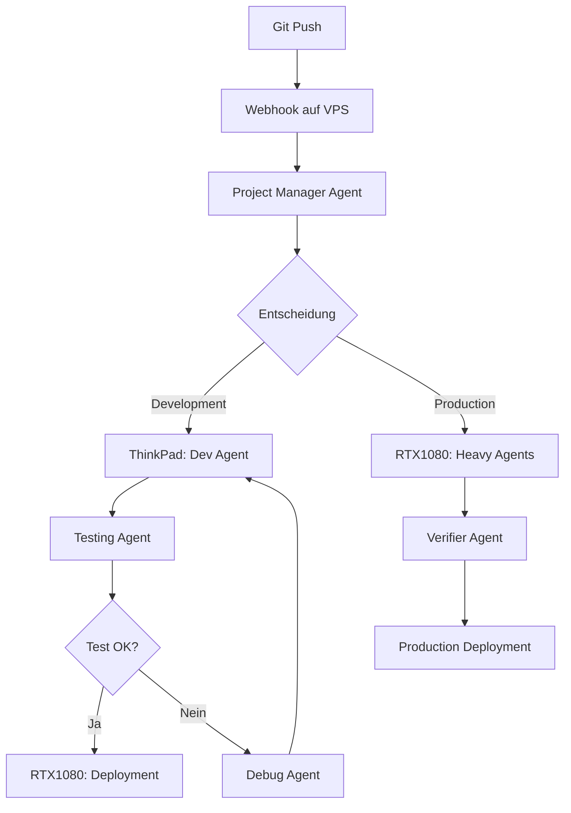

# 🎯 Überarbeiteter Schlachtplan - Homelab OSS Stack & J-Jeco Integration
**Version:** 2.0
**Datum:** 2025-12-24
**Status:** Aktualisiert & Agent-optimiert

---

## 📊 Executive Summary

Dieser Schlachtplan integriert:
- **Homelab OSS Stack** (Infrastruktur & Services)
- **J-Jeco AI Platform** (Multi-Agent System)
- **3-System-Architektur** (VPS, ThinkPad, RTX1080)
- **Agent-Empfehlungen für CD/CI**

---

## 🔍 Repository-Status & Versionen

### Homelab OSS Stack
- **Lokaler Stand:** `/home/fitna/homelab/infrastructure/`
- **Aktuelle Komponenten:**
  - Traefik v3.0 (Reverse Proxy)
  - Authentik (SSO)
  - Docker Compose 3.9
  - Proxmox VE 8
- **Empfehlung:** Regelmäßige Updates via `docker compose pull`

### J-Jeco AI Platform
- **Lokaler Stand:** `/home/fitna/homelab/ai-platform/1-first-agent/`
- **Aktuelle Konfiguration:**
  - OpenAI GPT-4o-mini (Standard)
  - Claude 3.5 Sonnet (Projekt-Manager)
  - Gemini 2.0 Flash (Content)
  - Perplexity (Research)
- **Empfehlung:** API-Keys via `sync-secrets.sh` synchronisieren

---

## 🏗️ 3-System-Architektur (Aktualisiert)

```
┌─────────────────────────────────────────────────────────────┐
│                    INTERNET (öffentlich)                     │
└────────────────────────────┬────────────────────────────────┘
                             │
                             │ SSH/HTTPS
                             ▼
            ┌────────────────────────────────────┐
            │  🌍 VPS (Cloud-Server)             │
            │  jonas-homelab-vps                 │
            │  91.107.198.37                     │
            │                                    │
            │  Rolle: "Der Außendienstler"       │
            │  • Öffentlich erreichbar           │
            │  • Newsletter versenden            │
            │  • Webhooks empfangen              │
            │  • API Gateway                     │
            │  • Lightweight AI-Agents           │
            └────────────────┬───────────────────┘
                             │
                             │ WireGuard VPN
                             │
            ┌────────────────┴───────────────────┐
            │                                    │
            ▼                                    ▼
┌───────────────────────┐          ┌───────────────────────┐
│ 💻 PVE ThinkPad       │          │ 🎮 Proxmox RTX 1080   │
│ 192.168.16.7          │          │ 192.168.17.1          │
│                       │          │                       │
│ Rolle: "Dev & Test"   │◄────────►│ Rolle: "Die Kraftmaschine" │
│ • Entwicklung         │ LAN      │ • AI Model Training  │
│ • Testing             │          │ • Video Generation    │
│ • Snapshots           │          │ • Heavy Computing     │
│ • Git Repository      │          │ • Production Services │
│ • Core Infrastructure │          │ • Heavy AI-Agents    │
└───────────────────────┘          └───────────────────────┘
```

---

## 🎯 Phase 1: Bestandsaufnahme & Validierung

### 1.1 Kritische Dateien prüfen

**✅ Zu kontrollieren:**

```bash
# Docker Compose Stack
/home/fitna/homelab/docker-compose.yml          # Root-Level (aktuell minimal)
/home/fitna/homelab/infrastructure/compose.yaml # Infrastructure (aktuell minimal)
/home/fitna/homelab/infrastructure/docker/stacks/*.yml  # Stack-Definitionen

# J-Jeco Konfiguration
/home/fitna/homelab/ai-platform/1-first-agent/config.py  # ✅ Geprüft
/home/fitna/homelab/ai-platform/ARCHITECTURE.md          # ✅ Geprüft (500 Zeilen)
/home/fitna/homelab/shared/scripts/sync-secrets.sh       # ✅ Geprüft

# Architektur-Dokumentation
/home/fitna/homelab/shared/docs/HOMELAB-ARCHITECTURE.md  # Unified Architecture
```

**🔍 Status-Check:**

```bash
# Prüfe Docker Compose Dateien
find /home/fitna/homelab -name "*.yml" -o -name "*.yaml" | grep -E "(compose|docker)" | head -10

# Prüfe J-Jeco Konfiguration
ls -la /home/fitna/homelab/ai-platform/1-first-agent/config.py
ls -la /home/fitna/homelab/shared/scripts/sync-secrets.sh

# Prüfe Architektur-Dokumentation
wc -l /home/fitna/homelab/ai-platform/ARCHITECTURE.md
```

### 1.2 System-Verbindungen testen

```bash
# Teste alle 3 Systeme
./shared/scripts/sync-secrets.sh test

# Erwartete Ausgabe:
# ✅ VPS (jonas-homelab-vps) - Erreichbar
# ✅ RTX1080 (192.168.17.1) - Erreichbar  
# ✅ ThinkPad (pve-thinkpad) - Erreichbar
```

---

## 🚀 Phase 2: Agent-Empfehlungen für CD/CI

### 2.1 Agent-Verteilung nach System-Stärken

**VPS (Lightweight Agents):**
```yaml
agents:
  - communicator_agent:      # Prompt Optimization
      model: claude-3-5-sonnet-20241022
      temperature: 0.5
      role: "Prompt optimization and communication enhancement"
  
  - project_manager_agent:    # Orchestration
      model: claude-3-5-sonnet-20241022
      temperature: 0.3
      role: "Strategic project coordinator and task orchestrator"
  
  - webhook_handler:          # Webhook Processing
      model: gpt-4o-mini
      temperature: 0.2
      role: "Webhook reception and routing"
```

**ThinkPad (Development & Testing):**
```yaml
agents:
  - development_agent:        # Code Development
      model: gpt-4o-mini
      temperature: 0.7
      role: "Code development and testing"
  
  - debug_agent:              # Debugging
      model: gpt-4o-mini
      temperature: 0.3
      role: "Error analysis and debugging"
  
  - snapshot_manager:         # Snapshot Management
      model: gpt-4o-mini
      temperature: 0.2
      role: "VM snapshot creation and rollback"
```

**RTX1080 (Heavy Agents):**
```yaml
agents:
  - content_creator_agent:   # GPU für Video
      model: gpt-4o-mini
      temperature: 0.8
      role: "Creative content generator for tutorials and newsletters"
      gpu_required: true
  
  - researcher_agent:         # Large Context
      model: gpt-4o-mini
      temperature: 0.4
      use_perplexity: true
      perplexity_model: llama-3.1-sonar-large-128k-online
      role: "Deep research on AI models, tech trends, and investments"
  
  - verifier_agent:           # Model Inference
      model: gpt-4o-mini
      temperature: 0.2
      role: "Fact-checking and quality assurance"
  
  - investment_analyzer:      # Data Crunching
      model: gpt-4o-mini
      temperature: 0.3
      role: "Data analysis and insights extraction"
```

### 2.2 CD/CI Agent-Orchestrierung

**Deployment-Workflow mit Agents:**



**Implementierung:**

```python
# /home/fitna/homelab/ai-platform/1-first-agent/agents/deployment_agent.py
"""
Deployment Agent für CD/CI Orchestrierung
"""
from agents.base_agent import BaseAgent

class DeploymentAgent(BaseAgent):
    def __init__(self):
        super().__init__(
            model="claude-3-5-sonnet-20241022",
            temperature=0.3,
            role="CD/CI Deployment Orchestrator"
        )
    
    def orchestrate_deployment(self, commit_hash, environment):
        """
        Orchestriert Deployment über alle 3 Systeme
        """
        # 1. VPS: Webhook empfangen
        # 2. ThinkPad: Tests ausführen
        # 3. RTX1080: Production Deployment
        pass
```

### 2.3 Agent-Konfiguration in config.py

**Aktuelle Konfiguration (geprüft):**

```python
# /home/fitna/homelab/ai-platform/1-first-agent/config.py

AGENT_CONFIG = {
    "project_manager": {
        "model": CLAUDE_MODEL,  # claude-3-5-sonnet-20241022
        "temperature": 0.3,
        "role": "Strategic project coordinator and task orchestrator"
    },
    "content_creator": {
        "model": DEFAULT_MODEL,  # gpt-4o-mini
        "temperature": 0.8,
        "role": "Creative content generator"
    },
    "researcher": {
        "model": DEFAULT_MODEL,
        "temperature": 0.4,
        "use_perplexity": True,
        "perplexity_model": PERPLEXITY_MODEL
    },
    "verifier": {
        "model": DEFAULT_MODEL,
        "temperature": 0.2,
        "role": "Fact-checking and quality assurance"
    },
    "communicator": {
        "model": CLAUDE_MODEL,
        "temperature": 0.5,
        "role": "Prompt optimization and communication enhancement"
    },
    "analyst": {
        "model": DEFAULT_MODEL,
        "temperature": 0.3,
        "role": "Data analysis and insights extraction"
    }
}
```

**Empfehlung: Erweitern um Deployment-Agents**

```python
# Erweiterte Agent-Konfiguration
AGENT_CONFIG.update({
    "deployment_orchestrator": {
        "model": CLAUDE_MODEL,
        "temperature": 0.3,
        "role": "CD/CI Deployment Orchestrator",
        "systems": ["vps", "thinkpad", "rtx1080"]
    },
    "webhook_handler": {
        "model": DEFAULT_MODEL,
        "temperature": 0.2,
        "role": "Webhook reception and routing",
        "location": "vps"
    },
    "testing_agent": {
        "model": DEFAULT_MODEL,
        "temperature": 0.3,
        "role": "Automated testing and validation",
        "location": "thinkpad"
    }
})
```

---

## 🔐 Phase 3: Secrets-Synchronisation (Kritisch)

### 3.1 Aktueller Stand

**Script:** `/home/fitna/homelab/shared/scripts/sync-secrets.sh`

**Funktionen:**
- ✅ Master Secrets auf RTX1080
- ✅ Sync zu VPS, ThinkPad, RTX1080
- ✅ SSH-basierte Übertragung
- ✅ Status-Check

**Verwendung:**

```bash
# Status prüfen
./shared/scripts/sync-secrets.sh status

# Secrets synchronisieren
./shared/scripts/sync-secrets.sh sync

# Verbindungen testen
./shared/scripts/sync-secrets.sh test
```

### 3.2 Empfehlungen

**✅ Bereits implementiert:**
- SSH-Keys (keine Passwörter)
- Verschlüsselte Übertragung (SCP)
- .env Dateien niemals in Git

**🔄 Verbesserungsvorschläge:**

1. **Automatische Synchronisation:**
   ```bash
   # Crontab auf RTX1080 (Master)
   0 */6 * * * /home/fitna/homelab/shared/scripts/sync-secrets.sh sync
   ```

2. **Versionierung:**
   ```bash
   # Backup vor jedem Sync
   cp .env.master .env.master.backup.$(date +%Y%m%d-%H%M%S)
   ```

3. **Monitoring:**
   ```bash
   # Alert bei Sync-Fehlern
   ./sync-secrets.sh sync || telegram-send "Secrets sync failed!"
   ```

---

## 🐳 Phase 4: Docker Compose Stack-Konsolidierung

### 4.1 Aktuelle Situation

**Problem:** Mehrere Docker Compose Dateien an verschiedenen Stellen

```
/home/fitna/homelab/docker-compose.yml          # Root (minimal)
/home/fitna/homelab/infrastructure/compose.yaml # Infrastructure (minimal)
/home/fitna/homelab/infrastructure/docker/stacks/
  ├── core.yml
  ├── core-hostA.yml
  ├── core-hostB.yml
  ├── core-phase1.yml
  ├── homeassistant.yml
  ├── media.yml
  ├── monitoring.yml
  └── automation.yml
```

### 4.2 Empfehlung: Konsolidierung

**Struktur:**

```
/home/fitna/homelab/
├── docker-compose.yml              # Root-Level (für einfache Deployments)
├── infrastructure/
│   ├── compose.yaml                # Infrastructure Stack
│   └── docker/
│       └── stacks/
│           ├── core.yml            # Core Services (Traefik, Authentik)
│           ├── homeassistant.yml   # Smart Home Stack
│           ├── media.yml           # Media Stack
│           ├── monitoring.yml      # Monitoring Stack
│           └── automation.yml      # Automation (n8n, etc.)
└── ai-platform/
    └── docker-compose.yml          # J-Jeco AI Agents Stack (neu)
```

**Root-Level docker-compose.yml (überarbeiten):**

```yaml
version: '3.9'

# Homelab OSS Stack - Root Orchestration
# Verweist auf spezifische Stacks in infrastructure/docker/stacks/

services:
  # Core Infrastructure (Host A)
  traefik:
    extends:
      file: infrastructure/docker/stacks/core.yml
      service: traefik
  
  # AI Platform (Host B)
  jjeco-agents:
    extends:
      file: ai-platform/docker-compose.yml
      service: agents
```

---

## 📋 Phase 5: Deployment-Strategie (Überarbeitet)

### 5.1 Host-Verteilung

**Host A: PVE ThinkPad (192.168.16.7)**
- Core Infrastructure (Traefik, Authentik, Portainer)
- Home Assistant Stack
- Monitoring (Prometheus, Grafana, Loki)
- Lightweight AI-Agents (Communicator, Project Manager)

**Host B: PVE RTX 1080 (192.168.17.1)**
- Database Layer (PostgreSQL, Redis)
- Media Stack (Jellyfin, *arr)
- Heavy AI-Agents (Content Creator, Researcher, Verifier)
- GPU-beschleunigte Services

**VPS: jonas-homelab-vps (91.107.198.37)**
- Public-facing Services
- Webhook Handler
- Newsletter Distribution
- API Gateway

### 5.2 Deployment-Reihenfolge

**Phase 1: Foundation (Host B)**
```bash
# 1. Database Layer
cd /home/fitna/homelab/infrastructure/docker/stacks
docker compose -f core-hostB.yml up -d

# Verify
docker exec postgresql pg_isready
docker exec redis redis-cli ping
```

**Phase 2: Core Services (Host A)**
```bash
# 2. Reverse Proxy & SSO
docker compose -f core-hostA.yml up -d

# Verify
curl -f http://localhost:8080  # Traefik Dashboard
```

**Phase 3: Application Stacks**
```bash
# 3. Monitoring (für Observability)
docker compose -f monitoring.yml up -d

# 4. Home Assistant
docker compose -f homeassistant.yml up -d

# 5. Media Stack
docker compose -f media.yml up -d

# 6. Automation
docker compose -f automation.yml up -d
```

**Phase 4: AI Platform (Host B)**
```bash
# 7. J-Jeco AI Agents
cd /home/fitna/homelab/ai-platform
docker compose up -d

# Oder direkt Python-basiert
cd 1-first-agent
source ../ai-agents-masterclass/bin/activate
python main.py moonshot-check
```

**Phase 5: VPS Integration**
```bash
# 8. VPS Services
ssh jonas-homelab-vps
cd ~/J-Jeco/1-first-agent
./sync-secrets.sh sync  # API-Keys synchronisieren
python main.py  # Lightweight Agents starten
```

---

## 🔄 Phase 6: CI/CD Pipeline (Agent-basiert)

### 6.1 GitHub Actions Workflow

```yaml
# .github/workflows/deploy.yml
name: Deploy to Homelab

on:
  push:
    branches: [main]
  workflow_dispatch:

jobs:
  deploy:
    runs-on: ubuntu-latest
    steps:
      - uses: actions/checkout@v3
      
      - name: Trigger VPS Webhook
        run: |
          curl -X POST https://91.107.198.37/webhook/deploy \
            -H "Authorization: Bearer ${{ secrets.DEPLOY_TOKEN }}"
      
      - name: Wait for Deployment
        run: |
          sleep 30
          curl -f https://traefik.yourdomain.com/health || exit 1
```

### 6.2 VPS Webhook Handler (Agent)

```python
# /home/fitna/homelab/ai-platform/1-first-agent/agents/webhook_handler.py
"""
Webhook Handler Agent für GitHub Actions
"""
from agents.base_agent import BaseAgent
from flask import Flask, request

app = Flask(__name__)

class WebhookHandlerAgent(BaseAgent):
    def __init__(self):
        super().__init__(
            model="gpt-4o-mini",
            temperature=0.2,
            role="Webhook reception and routing"
        )
    
    def handle_webhook(self, payload):
        """
        Verarbeitet GitHub Webhook und triggert Deployment
        """
        # 1. Validierung
        # 2. Project Manager Agent benachrichtigen
        # 3. Deployment orchestrieren
        pass

@app.route('/webhook/deploy', methods=['POST'])
def deploy_webhook():
    agent = WebhookHandlerAgent()
    agent.handle_webhook(request.json)
    return {'status': 'ok'}, 200
```

### 6.3 Deployment-Orchestrierung

```python
# Deployment Flow mit Agents
def deploy_workflow(commit_hash):
    """
    1. VPS: Webhook empfangen
    2. Project Manager: Deployment planen
    3. ThinkPad: Tests ausführen
    4. RTX1080: Production Deployment
    """
    
    # Step 1: VPS Webhook
    webhook_agent = WebhookHandlerAgent()
    webhook_agent.handle_webhook(commit_hash)
    
    # Step 2: Project Manager
    pm_agent = ProjectManagerAgent()
    plan = pm_agent.create_deployment_plan(commit_hash)
    
    # Step 3: ThinkPad Testing
    test_agent = TestingAgent()
    test_result = test_agent.run_tests(commit_hash)
    
    if not test_result.success:
        # Debug Agent
        debug_agent = DebugAgent()
        debug_agent.analyze_failures(test_result)
        return
    
    # Step 4: RTX1080 Production
    deploy_agent = DeploymentAgent()
    deploy_agent.deploy_to_production(plan)
    
    # Step 5: Verification
    verifier_agent = VerifierAgent()
    verifier_agent.verify_deployment(plan)
```

---

## 📊 Phase 7: Monitoring & Observability

### 7.1 Agent-Monitoring

**Prometheus Metrics für Agents:**

```yaml
# docker/prometheus/prometheus.yml
scrape_configs:
  - job_name: 'jjeco-agents'
    static_configs:
      - targets: ['rtx1080:8000', 'thinkpad:8000', 'vps:8000']
    metrics_path: '/metrics'
```

**Grafana Dashboard:**

```json
{
  "dashboard": "J-Jeco Agents",
  "panels": [
    {
      "title": "Agent Response Times",
      "targets": ["agent_response_time_seconds"]
    },
    {
      "title": "Agent Success Rate",
      "targets": ["agent_requests_total", "agent_errors_total"]
    },
    {
      "title": "API Key Usage",
      "targets": ["openai_api_calls_total", "anthropic_api_calls_total"]
    }
  ]
}
```

### 7.2 Log-Aggregation

**Loki Labels für Agents:**

```yaml
# docker/promtail/promtail-config.yml
scrape_configs:
  - job_name: jjeco-agents
    static_configs:
      - targets: ['localhost']
        labels:
          job: jjeco-agents
          system: '{{ .System }}'  # vps, thinkpad, rtx1080
          agent: '{{ .Agent }}'     # project_manager, content_creator, etc.
```

---

## 🔒 Phase 8: Sicherheit (Kritisch)

### 8.1 API-Key-Management

**✅ Bereits implementiert:**
- `sync-secrets.sh` für zentrale Verwaltung
- .env Dateien in .gitignore
- SSH-basierte Übertragung

**🔄 Empfehlungen:**

1. **Rotation:**
   ```bash
   # Monatliche Rotation
   0 0 1 * * /home/fitna/homelab/shared/scripts/rotate-api-keys.sh
   ```

2. **Audit:**
   ```bash
   # Logging aller API-Key-Zugriffe
   # In config.py erweitern um Audit-Logging
   ```

3. **Vault Integration (Optional):**
   ```bash
   # HashiCorp Vault für Production
   vault kv put secret/jjeco/api-keys \
     openai_key=sk-... \
     anthropic_key=sk-ant-...
   ```

### 8.2 Netzwerk-Sicherheit

**Firewall-Regeln:**

```bash
# Host A (ThinkPad)
ufw allow from 192.168.17.0/24  # Host B
ufw allow from 10.8.0.0/24       # WireGuard VPN
ufw deny 22/tcp                  # SSH nur via VPN

# Host B (RTX1080)
ufw allow from 192.168.16.0/24  # Host A
ufw allow from 10.8.0.0/24       # WireGuard VPN
ufw deny 22/tcp                  # SSH nur via VPN

# VPS
ufw allow 80/tcp                 # HTTP
ufw allow 443/tcp                # HTTPS
ufw allow 22/tcp                 # SSH (mit Fail2Ban)
```

---

## 📈 Phase 9: Optimierung & Performance

### 9.1 Agent-Performance

**Caching-Strategie:**

```python
# In config.py
CACHE_CONFIG = {
    "redis_host": "192.168.17.1",
    "redis_port": 6379,
    "ttl": 3600,  # 1 Stunde
    "enabled": True
}
```

**Model-Auswahl optimieren:**

```python
# Leichte Tasks → gpt-4o-mini (schnell, günstig)
# Schwere Tasks → claude-3-5-sonnet (bessere Qualität)
# Research → perplexity (online search)
```

### 9.2 Resource-Management

**GPU-Nutzung (RTX1080):**

```bash
# NVIDIA Container Runtime
docker run --gpus all nvidia/cuda:11.0-base

# Ollama mit GPU
docker run -d --gpus all \
  -v ollama:/root/.ollama \
  -p 11434:11434 \
  ollama/ollama
```

**CPU-Limits:**

```yaml
# docker-compose.yml
services:
  content_creator:
    deploy:
      resources:
        limits:
          cpus: '2.0'
          memory: 4G
```

---

## ✅ Phase 10: Checkliste & Validierung

### 10.1 Pre-Deployment Checklist

- [ ] Alle 3 Systeme erreichbar (VPS, ThinkPad, RTX1080)
- [ ] SSH-Keys konfiguriert
- [ ] Docker auf allen Hosts installiert
- [ ] Secrets synchronisiert (`sync-secrets.sh status`)
- [ ] Netzwerk-Firewall konfiguriert
- [ ] DNS/Cloudflare konfiguriert (optional)
- [ ] Backups eingerichtet

### 10.2 Post-Deployment Validierung

```bash
# 1. Services prüfen
docker ps --format "table {{.Names}}\t{{.Status}}"

# 2. Traefik Dashboard
curl -f http://localhost:8080

# 3. Authentik SSO
curl -f https://auth.yourdomain.com

# 4. AI Agents
cd /home/fitna/homelab/ai-platform/1-first-agent
python main.py moonshot-check

# 5. Monitoring
curl -f http://localhost:9090  # Prometheus
curl -f http://localhost:3000   # Grafana
```

### 10.3 Agent-Tests

```bash
# Teste alle Agents
cd /home/fitna/homelab/ai-platform/1-first-agent

# Project Manager
python -m agents.project_manager_agent --test

# Content Creator
python -m agents.content_creator_agent --test

# Researcher
python -m agents.researcher_agent --test

# Verifier
python -m agents.verifier_agent --test
```

---

## 🚨 Troubleshooting

### Häufige Probleme

**1. Secrets nicht synchronisiert:**
```bash
./shared/scripts/sync-secrets.sh status
./shared/scripts/sync-secrets.sh sync
```

**2. Agent kann API nicht erreichen:**
```bash
# Prüfe .env Datei
cat /home/fitna/homelab/ai-platform/1-first-agent/.env | grep API_KEY

# Teste API-Verbindung
python -c "import os; from dotenv import load_dotenv; load_dotenv(); print(os.getenv('OPENAI_API_KEY')[:10])"
```

**3. Docker Compose Fehler:**
```bash
# Logs prüfen
docker compose logs -f

# Netzwerk prüfen
docker network ls
docker network inspect homelab_network
```

**4. Agent-Performance-Probleme:**
```bash
# Prüfe Model-Auswahl in config.py
# Prüfe API-Limits
# Prüfe GPU-Nutzung (RTX1080)
nvidia-smi
```

---

## 📚 Referenzen

### Dokumentation
- `/home/fitna/homelab/ai-platform/ARCHITECTURE.md` - 3-System-Architektur
- `/home/fitna/homelab/shared/docs/HOMELAB-ARCHITECTURE.md` - Unified Architecture
- `/home/fitna/homelab/infrastructure/DEPLOYMENT.md` - Deployment Guide
- `/home/fitna/homelab/infrastructure/PRE-DEPLOYMENT-CHECKLIST.md` - Pre-Deployment

### Konfiguration
- `/home/fitna/homelab/ai-platform/1-first-agent/config.py` - Agent-Konfiguration
- `/home/fitna/homelab/shared/scripts/sync-secrets.sh` - Secrets-Sync
- `/home/fitna/homelab/infrastructure/docker/stacks/*.yml` - Docker Stacks

### Scripts
- `sync-secrets.sh` - API-Key-Synchronisation
- `snapshot.sh` - Backup-Script
- `validate-pre-deployment.sh` - Pre-Deployment Validation

---

## 🎯 Nächste Schritte

1. **Sofort:**
   - [ ] Secrets synchronisieren (`sync-secrets.sh sync`)
   - [ ] System-Verbindungen testen
   - [ ] Docker Compose Stacks konsolidieren

2. **Diese Woche:**
   - [ ] Agent-Konfiguration erweitern (Deployment-Agents)
   - [ ] CI/CD Pipeline einrichten
   - [ ] Monitoring für Agents konfigurieren

3. **Dieser Monat:**
   - [ ] Vault-Integration (optional)
   - [ ] Performance-Optimierung
   - [ ] Dokumentation aktualisieren

---

**Version:** 2.0
**Letzte Aktualisierung:** 2025-12-24
**Status:** ✅ Bereit für Deployment

---

## 📞 Support

Bei Fragen oder Problemen:
1. Prüfe Logs: `docker compose logs -f`
2. Prüfe Dokumentation: `/home/fitna/homelab/shared/docs/`
3. Prüfe Agent-Status: `python main.py moonshot-check`

**Viel Erfolg beim Deployment! 🚀**

