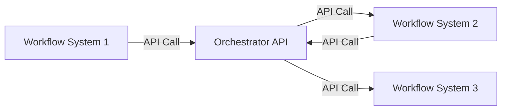

# Pattern 3: API-basierte Integration

## Übersicht

API-basierte Integration ermöglicht standardisierte, RESTful Kommunikation zwischen Workflow-Systemen über HTTP-APIs.

## Architektur



## Vorteile

✅ **Standardisiert** - REST-Standard  
✅ **Gut dokumentiert** - API-Dokumentation  
✅ **RESTful** - Standard HTTP-Methoden  
✅ **Einfach zu testen** - HTTP-basiert  

## Nachteile

⚠️ **Synchron** - Kann blockieren  
⚠️ **Rate Limiting** - API-Rate-Limits  
⚠️ **Latenz** - HTTP-Overhead  

## Implementierung

### REST API Beispiel

```python
from fastapi import FastAPI, HTTPException
import requests

app = FastAPI()

@app.post("/trigger-workflow")
async def trigger_workflow(workflow_id: str, payload: dict):
    """Trigger workflow in external system"""
    try:
        response = requests.post(
            f'https://workflow-system.com/api/workflows/{workflow_id}/trigger',
            json=payload,
            timeout=30
        )
        response.raise_for_status()
        return response.json()
    except requests.exceptions.RequestException as e:
        raise HTTPException(status_code=500, detail=str(e))

@app.get("/workflow-status/{workflow_id}")
async def get_workflow_status(workflow_id: str):
    """Get workflow status"""
    try:
        response = requests.get(
            f'https://workflow-system.com/api/workflows/{workflow_id}/status',
            timeout=10
        )
        response.raise_for_status()
        return response.json()
    except requests.exceptions.RequestException as e:
        raise HTTPException(status_code=500, detail=str(e))
```

### n8n API Integration

```json
{
  "nodes": [
    {
      "name": "HTTP Request",
      "type": "n8n-nodes-base.httpRequest",
      "parameters": {
        "url": "https://api.example.com/workflows/trigger",
        "method": "POST",
        "authentication": "genericCredentialType",
        "genericAuthType": "httpHeaderAuth",
        "sendHeaders": true,
        "headerParameters": {
          "parameters": [
            {
              "name": "Authorization",
              "value": "Bearer {{ $env.API_TOKEN }}"
            }
          ]
        },
        "sendBody": true,
        "bodyParameters": {
          "parameters": [
            {
              "name": "workflow_id",
              "value": "={{ $json.workflow_id }}"
            },
            {
              "name": "payload",
              "value": "={{ $json.payload }}"
            }
          ]
        }
      }
    }
  ]
}
```

### Prefect API Integration

```python
from prefect import flow, task
import requests
from typing import Optional

@task
def trigger_workflow_api(workflow_id: str, payload: dict) -> dict:
    """Trigger workflow via API"""
    response = requests.post(
        f'https://api.example.com/workflows/{workflow_id}/trigger',
        json=payload,
        headers={'Authorization': f'Bearer {API_TOKEN}'},
        timeout=30
    )
    response.raise_for_status()
    return response.json()

@task
def get_workflow_status(workflow_id: str) -> Optional[dict]:
    """Get workflow status via API"""
    response = requests.get(
        f'https://api.example.com/workflows/{workflow_id}/status',
        headers={'Authorization': f'Bearer {API_TOKEN}'},
        timeout=10
    )
    if response.status_code == 404:
        return None
    response.raise_for_status()
    return response.json()

@flow
def api_based_workflow(workflow_id: str, payload: dict):
    """Workflow with API integration"""
    # Trigger workflow
    result = trigger_workflow_api(workflow_id, payload)
    
    # Poll for status
    while True:
        status = get_workflow_status(result['workflow_run_id'])
        if status and status['status'] in ['completed', 'failed']:
            return status
        time.sleep(5)
```

## Best Practices

### 1. API Authentication

```python
# Token-based Authentication
headers = {
    'Authorization': f'Bearer {API_TOKEN}',
    'Content-Type': 'application/json'
}

# API Key Authentication
headers = {
    'X-API-Key': API_KEY,
    'Content-Type': 'application/json'
}

# OAuth 2.0
from requests_oauthlib import OAuth2Session
oauth = OAuth2Session(client_id, token=token)
response = oauth.get('https://api.example.com/workflows')
```

### 2. Rate Limiting

```python
from ratelimit import limits, sleep_and_retry
from datetime import timedelta

@sleep_and_retry
@limits(calls=100, period=timedelta(minutes=1))
def api_call(url: str, payload: dict):
    """API call with rate limiting"""
    response = requests.post(url, json=payload)
    return response.json()
```

### 3. Retry Logic

```python
from tenacity import retry, stop_after_attempt, wait_exponential

@retry(
    stop=stop_after_attempt(3),
    wait=wait_exponential(multiplier=1, min=4, max=10)
)
def api_call_with_retry(url: str, payload: dict):
    """API call with retry logic"""
    response = requests.post(url, json=payload, timeout=30)
    response.raise_for_status()
    return response.json()
```

### 4. Error Handling

```python
import requests
from requests.exceptions import RequestException

def safe_api_call(url: str, payload: dict):
    """Safe API call with error handling"""
    try:
        response = requests.post(url, json=payload, timeout=30)
        response.raise_for_status()
        return {'success': True, 'data': response.json()}
    except requests.exceptions.Timeout:
        return {'success': False, 'error': 'Timeout'}
    except requests.exceptions.HTTPError as e:
        return {'success': False, 'error': f'HTTP Error: {e}'}
    except RequestException as e:
        return {'success': False, 'error': str(e)}
```

## API Design Best Practices

### 1. RESTful Design

```python
# Good: RESTful endpoints
GET    /api/workflows              # List workflows
GET    /api/workflows/{id}          # Get workflow
POST   /api/workflows               # Create workflow
PUT    /api/workflows/{id}          # Update workflow
DELETE /api/workflows/{id}          # Delete workflow
POST   /api/workflows/{id}/trigger  # Trigger workflow
GET    /api/workflows/{id}/status   # Get status
```

### 2. Versioning

```python
# API Versioning
@app.get("/api/v1/workflows")
@app.get("/api/v2/workflows")
```

### 3. Pagination

```python
@app.get("/api/workflows")
async def list_workflows(
    page: int = 1,
    page_size: int = 20
):
    """List workflows with pagination"""
    offset = (page - 1) * page_size
    workflows = get_workflows(offset, page_size)
    return {
        'data': workflows,
        'page': page,
        'page_size': page_size,
        'total': get_workflow_count()
    }
```

## Monitoring

- API Response Time
- API Success Rate
- API Error Rate
- Rate Limit Usage
- API Throughput

## Fazit

API-basierte Integration ist ideal für **standardisierte, RESTful Workflow-zu-Workflow-Integration**. Rate Limiting und Error Handling sind entscheidend.

