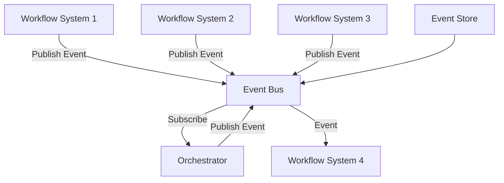

# Pattern 4: Event Bus Integration

## Übersicht

Event Bus Integration ermöglicht decoupled, skalierbare Kommunikation zwischen Workflow-Systemen über einen zentralen Event Bus.

## Architektur



## Vorteile

✅ **Decoupled** - Entkoppelte Systeme  
✅ **Skalierbar** - Horizontal scaling  
✅ **Event Sourcing** - Vollständige Event-History  
✅ **Flexibel** - Multiple Subscribers  

## Nachteile

⚠️ **Komplexe Architektur** - Mehr Komponenten  
⚠️ **Event Ordering** - Event Ordering Challenges  
⚠️ **Event Schema** - Schema-Evolution erforderlich  

## Implementierung

### Event Bus mit Kafka

```python
from kafka import KafkaProducer, KafkaConsumer
import json
from typing import Callable

class EventBus:
    def __init__(self, bootstrap_servers: list):
        self.producer = KafkaProducer(
            bootstrap_servers=bootstrap_servers,
            value_serializer=lambda v: json.dumps(v).encode('utf-8')
        )
        self.consumers = {}
    
    def publish(self, topic: str, event: dict):
        """Publish event to topic"""
        self.producer.send(topic, event)
        self.producer.flush()
    
    def subscribe(self, topic: str, group_id: str, callback: Callable):
        """Subscribe to topic"""
        consumer = KafkaConsumer(
            topic,
            bootstrap_servers=self.bootstrap_servers,
            value_deserializer=lambda m: json.loads(m.decode('utf-8')),
            group_id=group_id
        )
        
        for message in consumer:
            callback(message.value)

# Usage
event_bus = EventBus(['localhost:9092'])

# Publish event
event_bus.publish('workflow-events', {
    'type': 'workflow.started',
    'workflow_id': '123',
    'timestamp': '2024-01-01T00:00:00Z'
})

# Subscribe to events
def handle_event(event: dict):
    print(f"Received event: {event}")

event_bus.subscribe('workflow-events', 'orchestrator', handle_event)
```

### Event Bus mit Redis Streams

```python
import redis
import json

class EventBus:
    def __init__(self, host: str = 'localhost', port: int = 6379):
        self.redis = redis.Redis(host=host, port=port, db=0)
    
    def publish(self, stream: str, event: dict):
        """Publish event to stream"""
        self.redis.xadd(stream, event)
    
    def subscribe(self, stream: str, group: str, consumer: str, callback: Callable):
        """Subscribe to stream"""
        # Create consumer group if not exists
        try:
            self.redis.xgroup_create(stream, group, id='0', mkstream=True)
        except redis.exceptions.ResponseError:
            pass  # Group already exists
        
        while True:
            messages = self.redis.xreadgroup(
                group,
                consumer,
                {stream: '>'},
                count=1,
                block=1000
            )
            
            for stream_name, stream_messages in messages:
                for message_id, message_data in stream_messages:
                    event = {k.decode(): v.decode() for k, v in message_data.items()}
                    callback(event)
                    # Acknowledge message
                    self.redis.xack(stream, group, message_id)

# Usage
event_bus = EventBus()

# Publish event
event_bus.publish('workflow-events', {
    'type': 'workflow.started',
    'workflow_id': '123'
})

# Subscribe to events
def handle_event(event: dict):
    print(f"Received event: {event}")

event_bus.subscribe('workflow-events', 'orchestrator', 'consumer-1', handle_event)
```

### Event Sourcing

```python
from datetime import datetime
from typing import List, Dict
import json

class EventStore:
    def __init__(self, storage: str = 'events.json'):
        self.storage = storage
        self.events: List[Dict] = []
        self.load_events()
    
    def load_events(self):
        """Load events from storage"""
        try:
            with open(self.storage, 'r') as f:
                self.events = json.load(f)
        except FileNotFoundError:
            self.events = []
    
    def save_events(self):
        """Save events to storage"""
        with open(self.storage, 'w') as f:
            json.dump(self.events, f, indent=2)
    
    def append(self, event: Dict):
        """Append event to store"""
        event['timestamp'] = datetime.now().isoformat()
        event['id'] = len(self.events) + 1
        self.events.append(event)
        self.save_events()
    
    def get_events(self, workflow_id: str = None) -> List[Dict]:
        """Get events, optionally filtered by workflow_id"""
        if workflow_id:
            return [e for e in self.events if e.get('workflow_id') == workflow_id]
        return self.events
    
    def replay_events(self, workflow_id: str, callback: Callable):
        """Replay events for a workflow"""
        events = self.get_events(workflow_id)
        for event in events:
            callback(event)

# Usage
event_store = EventStore()

# Append event
event_store.append({
    'type': 'workflow.started',
    'workflow_id': '123',
    'data': {'status': 'running'}
})

# Replay events
def process_event(event: Dict):
    print(f"Processing event: {event}")

event_store.replay_events('123', process_event)
```

## Integration mit Workflow-Tools

### n8n Event Bus Integration

```json
{
  "nodes": [
    {
      "name": "Kafka Consumer",
      "type": "n8n-nodes-base.kafka",
      "parameters": {
        "operation": "consume",
        "topic": "workflow-events",
        "options": {
          "groupId": "orchestrator"
        }
      }
    },
    {
      "name": "Process Event",
      "type": "n8n-nodes-base.function",
      "parameters": {
        "functionCode": "const event = items[0].json;\nif (event.type === 'workflow.started') {\n  return [{json: {action: 'trigger', workflow_id: event.workflow_id}}];\n}\nreturn [];"
      }
    },
    {
      "name": "Publish Event",
      "type": "n8n-nodes-base.kafka",
      "parameters": {
        "operation": "produce",
        "topic": "processed-events",
        "message": "={{ $json }}"
      }
    }
  ]
}
```

### Prefect Event Bus Integration

```python
from prefect import flow, task
from kafka import KafkaProducer, KafkaConsumer
import json

@task
def consume_event(topic: str, group_id: str) -> dict:
    """Consume event from Kafka"""
    consumer = KafkaConsumer(
        topic,
        bootstrap_servers=['localhost:9092'],
        value_deserializer=lambda m: json.loads(m.decode('utf-8')),
        group_id=group_id
    )
    
    for message in consumer:
        return message.value

@task
def publish_event(topic: str, event: dict):
    """Publish event to Kafka"""
    producer = KafkaProducer(
        bootstrap_servers=['localhost:9092'],
        value_serializer=lambda v: json.dumps(v).encode('utf-8')
    )
    producer.send(topic, event)
    producer.flush()

@flow
def event_bus_workflow():
    """Workflow with event bus integration"""
    event = consume_event('workflow-events', 'orchestrator')
    
    # Process event
    processed_event = {
        'type': 'workflow.processed',
        'workflow_id': event['workflow_id'],
        'status': 'completed'
    }
    
    publish_event('processed-events', processed_event)
```

## Best Practices

### 1. Event Schema

```python
from pydantic import BaseModel
from datetime import datetime
from typing import Optional

class WorkflowEvent(BaseModel):
    type: str
    workflow_id: str
    timestamp: datetime
    data: Optional[dict] = None
    metadata: Optional[dict] = None
```

### 2. Event Versioning

```python
class WorkflowEventV1(BaseModel):
    type: str
    workflow_id: str
    timestamp: datetime

class WorkflowEventV2(BaseModel):
    type: str
    workflow_id: str
    timestamp: datetime
    version: int = 2
    data: Optional[dict] = None
```

### 3. Event Ordering

```python
# Kafka: Use single partition for ordering
producer.send(
    topic,
    key=event['workflow_id'],  # Same key = same partition
    value=event
)
```

### 4. Event Filtering

```python
def filter_events(events: List[Dict], event_type: str) -> List[Dict]:
    """Filter events by type"""
    return [e for e in events if e.get('type') == event_type]
```

## Monitoring

- Event Publishing Rate
- Event Consumption Rate
- Event Processing Latency
- Event Store Size
- Consumer Lag

## Fazit

Event Bus Integration ist ideal für **decoupled, skalierbare Workflow-zu-Workflow-Integration** mit Event Sourcing. Kafka oder Redis Streams können verwendet werden.

