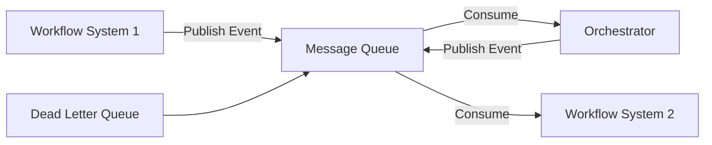

# Pattern 2: Message Queue Integration

## Übersicht

Message Queue Integration ermöglicht zuverlässige, asynchrone Kommunikation zwischen Workflow-Systemen über Message Queues.

## Architektur



## Vorteile

✅ **Zuverlässig** - Message Persistence  
✅ **Asynchron** - Non-blocking  
✅ **Skalierbar** - Horizontal scaling  
✅ **Decoupled** - Entkoppelte Systeme  

## Nachteile

⚠️ **Zusätzliche Infrastruktur** - Message Queue erforderlich  
⚠️ **Komplexere Architektur** - Mehr Komponenten  
⚠️ **Message Ordering** - Event Ordering Challenges  

## Implementierung

### RabbitMQ Beispiel

```python
import pika
import json

# Producer
def publish_event(queue: str, event: dict):
    """Publish event to queue"""
    connection = pika.BlockingConnection(
        pika.ConnectionParameters('localhost')
    )
    channel = connection.channel()
    channel.queue_declare(queue=queue, durable=True)
    
    channel.basic_publish(
        exchange='',
        routing_key=queue,
        body=json.dumps(event),
        properties=pika.BasicProperties(
            delivery_mode=2,  # Make message persistent
        )
    )
    connection.close()

# Consumer
def consume_events(queue: str, callback):
    """Consume events from queue"""
    connection = pika.BlockingConnection(
        pika.ConnectionParameters('localhost')
    )
    channel = connection.channel()
    channel.queue_declare(queue=queue, durable=True)
    
    def on_message(ch, method, properties, body):
        event = json.loads(body)
        try:
            callback(event)
            ch.basic_ack(delivery_tag=method.delivery_tag)
        except Exception as e:
            # Send to dead letter queue
            ch.basic_nack(delivery_tag=method.delivery_tag, requeue=False)
    
    channel.basic_consume(
        queue=queue,
        on_message_callback=on_message
    )
    channel.start_consuming()
```

### Kafka Beispiel

```python
from kafka import KafkaProducer, KafkaConsumer
import json

# Producer
def publish_event(topic: str, event: dict):
    """Publish event to Kafka topic"""
    producer = KafkaProducer(
        bootstrap_servers=['localhost:9092'],
        value_serializer=lambda v: json.dumps(v).encode('utf-8')
    )
    producer.send(topic, event)
    producer.flush()

# Consumer
def consume_events(topic: str, callback):
    """Consume events from Kafka topic"""
    consumer = KafkaConsumer(
        topic,
        bootstrap_servers=['localhost:9092'],
        value_deserializer=lambda m: json.loads(m.decode('utf-8')),
        group_id='workflow-orchestrator'
    )
    
    for message in consumer:
        try:
            callback(message.value)
        except Exception as e:
            # Error handling
            print(f"Error processing message: {e}")
```

### Redis Pub/Sub Beispiel

```python
import redis
import json

# Publisher
def publish_event(channel: str, event: dict):
    """Publish event to Redis channel"""
    r = redis.Redis(host='localhost', port=6379, db=0)
    r.publish(channel, json.dumps(event))

# Subscriber
def subscribe_events(channel: str, callback):
    """Subscribe to Redis channel"""
    r = redis.Redis(host='localhost', port=6379, db=0)
    pubsub = r.pubsub()
    pubsub.subscribe(channel)
    
    for message in pubsub.listen():
        if message['type'] == 'message':
            event = json.loads(message['data'])
            callback(event)
```

## Integration mit Workflow-Tools

### n8n mit RabbitMQ

```json
{
  "nodes": [
    {
      "name": "RabbitMQ Trigger",
      "type": "n8n-nodes-base.rabbitmq",
      "parameters": {
        "queue": "workflow-events",
        "options": {
          "durable": true
        }
      }
    },
    {
      "name": "Process Event",
      "type": "n8n-nodes-base.function",
      "parameters": {
        "functionCode": "const event = items[0].json;\nreturn [{json: {processed: true, event}}];"
      }
    },
    {
      "name": "Publish Result",
      "type": "n8n-nodes-base.rabbitmq",
      "parameters": {
        "operation": "publish",
        "queue": "processed-events",
        "content": "={{ $json }}"
      }
    }
  ]
}
```

### Prefect mit RabbitMQ

```python
from prefect import flow, task
import pika
import json

@task
def consume_rabbitmq_event(queue: str) -> dict:
    """Consume event from RabbitMQ"""
    connection = pika.BlockingConnection(
        pika.ConnectionParameters('localhost')
    )
    channel = connection.channel()
    method, properties, body = channel.basic_get(queue=queue)
    
    if method:
        event = json.loads(body)
        channel.basic_ack(delivery_tag=method.delivery_tag)
        connection.close()
        return event
    connection.close()
    return None

@task
def publish_rabbitmq_event(queue: str, event: dict):
    """Publish event to RabbitMQ"""
    connection = pika.BlockingConnection(
        pika.ConnectionParameters('localhost')
    )
    channel = connection.channel()
    channel.queue_declare(queue=queue, durable=True)
    channel.basic_publish(
        exchange='',
        routing_key=queue,
        body=json.dumps(event),
        properties=pika.BasicProperties(delivery_mode=2)
    )
    connection.close()

@flow
def message_queue_workflow():
    """Workflow with message queue integration"""
    event = consume_rabbitmq_event('workflow-events')
    if event:
        # Process event
        result = process_event(event)
        publish_rabbitmq_event('processed-events', result)
```

## Best Practices

### 1. Message Persistence

```python
# RabbitMQ
properties = pika.BasicProperties(
    delivery_mode=2,  # Make message persistent
)

# Kafka
producer = KafkaProducer(
    acks='all',  # Wait for all replicas
    retries=3
)
```

### 2. Dead Letter Queue

```python
# RabbitMQ Dead Letter Queue
channel.queue_declare(
    queue='workflow-events',
    durable=True,
    arguments={
        'x-dead-letter-exchange': 'dlx',
        'x-dead-letter-routing-key': 'dlq'
    }
)
```

### 3. Message Ordering

```python
# Kafka: Use single partition for ordering
producer.send(
    topic,
    key=event['workflow_id'],  # Same key = same partition
    value=event
)
```

### 4. Error Handling

```python
from tenacity import retry, stop_after_attempt

@retry(stop=stop_after_attempt(3))
def process_message(message: dict):
    """Process message with retry"""
    try:
        # Process message
        process_event(message)
    except Exception as e:
        # Send to dead letter queue
        send_to_dlq(message, str(e))
        raise
```

## Monitoring

- Message Queue Length
- Consumer Lag
- Message Processing Rate
- Error Rate
- Dead Letter Queue Size

## Fazit

Message Queue Integration ist ideal für **zuverlässige, asynchrone Workflow-zu-Workflow-Integration**. RabbitMQ, Kafka oder Redis können verwendet werden.

