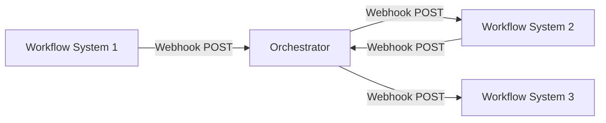

# Pattern 1: Webhook-basierte Integration

## Übersicht

Webhook-basierte Integration ermöglicht Real-time Kommunikation zwischen Workflow-Systemen über HTTP-Webhooks.

## Architektur



## Vorteile

✅ **Einfach zu implementieren** - Standard HTTP  
✅ **Real-time** - Sofortige Benachrichtigung  
✅ **Loose Coupling** - Entkoppelte Systeme  
✅ **Standardisiert** - HTTP-Standard  

## Nachteile

⚠️ **Webhook-Endpunkte erforderlich** - Öffentliche Endpunkte  
⚠️ **Error Handling komplex** - Retry-Logik erforderlich  
⚠️ **Sicherheit** - Webhook-Signatur-Verifikation erforderlich  

## Implementierung

### n8n Beispiel

```json
{
  "nodes": [
    {
      "name": "Webhook",
      "type": "n8n-nodes-base.webhook",
      "parameters": {
        "path": "github-webhook",
        "httpMethod": "POST",
        "responseMode": "responseNode",
        "options": {
          "rawBody": true
        }
      }
    },
    {
      "name": "Verify Signature",
      "type": "n8n-nodes-base.function",
      "parameters": {
        "functionCode": "const crypto = require('crypto');\nconst secret = $env.WEBHOOK_SECRET;\nconst signature = $input.first().headers['x-hub-signature-256'];\nconst payload = $input.first().binary.data.data;\nconst expectedSignature = 'sha256=' + crypto.createHmac('sha256', secret).update(payload).digest('hex');\nif (signature !== expectedSignature) {\n  throw new Error('Invalid signature');\n}\nreturn $input.all();"
      }
    },
    {
      "name": "Trigger GitLab",
      "type": "n8n-nodes-base.httpRequest",
      "parameters": {
        "url": "https://gitlab.com/api/v4/projects/:id/trigger/pipeline",
        "method": "POST",
        "bodyParameters": {
          "ref": "={{ $json.ref }}",
          "token": "={{ $env.GITLAB_TOKEN }}"
        }
      }
    }
  ]
}
```

### Prefect Beispiel

```python
from prefect import flow, task
from prefect.server.schemas.schedules import CronSchedule
import requests
import hmac
import hashlib

@task
def verify_webhook_signature(payload: bytes, signature: str, secret: str) -> bool:
    """Verify webhook signature"""
    expected_signature = hmac.new(
        secret.encode(),
        payload,
        hashlib.sha256
    ).hexdigest()
    return hmac.compare_digest(f"sha256={expected_signature}", signature)

@task
def trigger_gitlab_ci(project_id: str, ref: str):
    """Trigger GitLab CI via webhook"""
    response = requests.post(
        f'https://gitlab.com/api/v4/projects/{project_id}/trigger/pipeline',
        data={'ref': ref, 'token': 'GITLAB_TOKEN'}
    )
    return response.json()

@flow
def webhook_handler(payload: dict, signature: str):
    """Handle webhook and trigger workflow"""
    # Verify signature
    if not verify_webhook_signature(
        str(payload).encode(),
        signature,
        'WEBHOOK_SECRET'
    ):
        raise ValueError("Invalid signature")
    
    # Trigger GitLab CI
    result = trigger_gitlab_ci('12345', payload.get('ref', 'main'))
    return result
```

## Best Practices

### 1. Webhook-Sicherheit

```python
# Signature Verification
import hmac
import hashlib

def verify_signature(payload: bytes, signature: str, secret: str) -> bool:
    expected = hmac.new(
        secret.encode(),
        payload,
        hashlib.sha256
    ).hexdigest()
    return hmac.compare_digest(f"sha256={expected}", signature)
```

### 2. Error Handling

```python
from tenacity import retry, stop_after_attempt, wait_exponential

@retry(stop=stop_after_attempt(3), wait=wait_exponential(multiplier=1, min=4, max=10))
def send_webhook(url: str, payload: dict):
    """Send webhook with retry logic"""
    response = requests.post(url, json=payload, timeout=10)
    response.raise_for_status()
    return response.json()
```

### 3. Idempotenz

```python
import hashlib
import redis

def is_duplicate(payload: dict) -> bool:
    """Check if webhook is duplicate"""
    payload_hash = hashlib.sha256(str(payload).encode()).hexdigest()
    r = redis.Redis()
    if r.exists(f"webhook:{payload_hash}"):
        return True
    r.setex(f"webhook:{payload_hash}", 3600, "1")
    return False
```

## Sicherheitsrichtlinien

1. **Signature Verification**: Immer Webhook-Signaturen verifizieren
2. **HTTPS**: Nur HTTPS-Endpunkte verwenden
3. **Rate Limiting**: Rate Limiting implementieren
4. **IP Whitelisting**: IP-Whitelisting wo möglich
5. **Token-basierte Auth**: Token-basierte Authentifizierung

## Monitoring

- Webhook-Delivery-Rate
- Webhook-Latenz
- Error-Rate
- Retry-Rate

## Fazit

Webhook-basierte Integration ist ideal für **Real-time Workflow-zu-Workflow-Integration** mit einfacher Implementierung. Sicherheit und Error Handling sind entscheidend.

