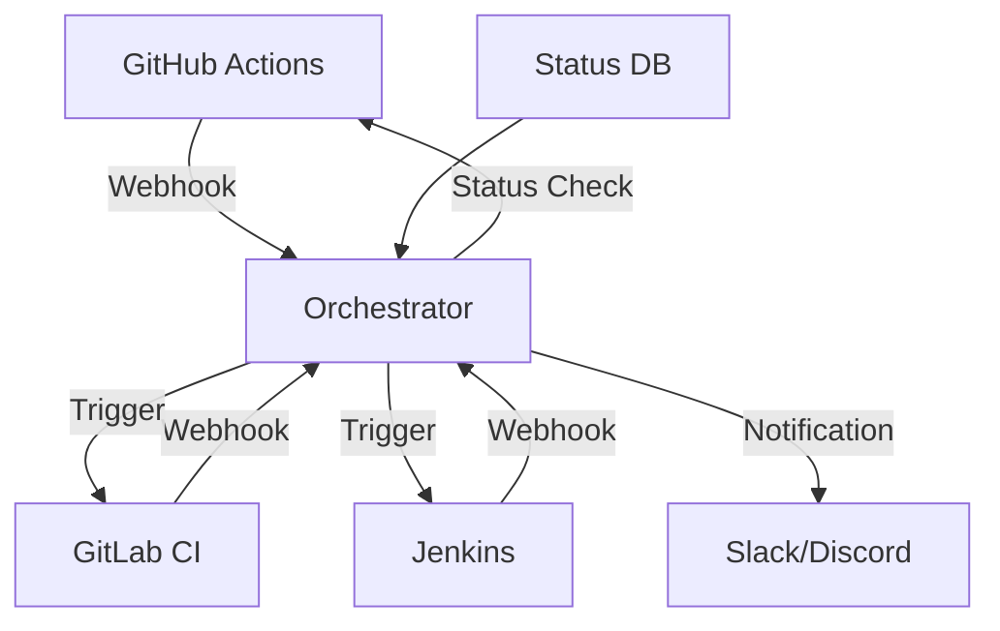

# Use Case 1: CI/CD Pipeline Orchestrierung

## Übersicht

Automatische Orchestrierung von CI/CD-Pipelines über verschiedene Plattformen hinweg, z.B. GitHub Actions → GitLab CI → Jenkins → Deployment.

## Szenario

**Problem:**
- Verschiedene CI/CD-Plattformen im Einsatz
- Workflows müssen zwischen Plattformen weitergeleitet werden
- Manuelle Koordination erforderlich
- Fehleranfällig und zeitaufwändig

**Lösung:**
- Automatische Weiterleitung zwischen CI/CD-Plattformen
- Event-basierte Trigger
- Status-Tracking über Plattformen hinweg
- Automatische Fehlerbehandlung

## Anforderungen

### Funktionale Anforderungen

1. **Webhook-Support**
   - Empfang von Webhooks von verschiedenen Plattformen
   - Senden von Webhooks zu verschiedenen Plattformen
   - Webhook-Signatur-Verifikation

2. **Status-Tracking**
   - Tracking des Status von Workflows
   - Aggregation von Status-Informationen
   - Status-Benachrichtigungen

3. **Error Handling**
   - Automatische Retry-Mechanismen
   - Fehler-Benachrichtigungen
   - Rollback-Mechanismen

4. **Conditional Routing**
   - Bedingte Weiterleitung basierend auf Ergebnissen
   - Branch-basierte Routing
   - Environment-basierte Routing

### Nicht-funktionale Anforderungen

- **Zuverlässigkeit**: 99.9% Uptime
- **Latenz**: < 5 Sekunden für Webhook-Weiterleitung
- **Skalierbarkeit**: Unterstützung für 100+ gleichzeitige Workflows
- **Sicherheit**: Webhook-Signatur-Verifikation

## Architektur



## Implementierung

### Option 1: n8n

**Vorteile:**
- Visueller Editor
- Native Webhook-Support
- Einfache Integration

**Workflow:**
1. Webhook von GitHub Actions empfangen
2. Status prüfen
3. GitLab CI Pipeline triggern
4. Status überwachen
5. Benachrichtigung senden

**Beispiel-Workflow:**
```json
{
  "nodes": [
    {
      "name": "GitHub Webhook",
      "type": "n8n-nodes-base.webhook",
      "parameters": {
        "path": "github-actions",
        "httpMethod": "POST"
      }
    },
    {
      "name": "Check Status",
      "type": "n8n-nodes-base.if",
      "parameters": {
        "conditions": {
          "string": [
            {
              "value1": "={{ $json.status }}",
              "operation": "equal",
              "value2": "success"
            }
          ]
        }
      }
    },
    {
      "name": "Trigger GitLab",
      "type": "n8n-nodes-base.httpRequest",
      "parameters": {
        "url": "https://gitlab.com/api/v4/projects/:id/trigger/pipeline",
        "method": "POST"
      }
    }
  ]
}
```

### Option 2: Prefect

**Vorteile:**
- Python-first
- Gute Developer Experience
- Automatisches Error Handling

**Beispiel-Flow:**
```python
from prefect import flow, task
import requests

@task
def check_github_status(repo: str, run_id: str):
    response = requests.get(
        f'https://api.github.com/repos/{repo}/actions/runs/{run_id}'
    )
    return response.json()['status']

@task
def trigger_gitlab_ci(project_id: str, ref: str):
    response = requests.post(
        f'https://gitlab.com/api/v4/projects/{project_id}/trigger/pipeline',
        data={'ref': ref, 'token': 'GITLAB_TOKEN'}
    )
    return response.json()

@flow
def ci_cd_orchestration(repo: str, run_id: str, gitlab_project_id: str):
    status = check_github_status(repo, run_id)
    
    if status == 'completed':
        result = trigger_gitlab_ci(gitlab_project_id, 'main')
        return result
    else:
        raise Exception(f"GitHub Actions status: {status}")
```

### Option 3: Argo Workflows

**Vorteile:**
- Kubernetes-native
- Container-basiert
- CI/CD Integration

**Beispiel-Workflow:**
```yaml
apiVersion: argoproj.io/v1alpha1
kind: Workflow
metadata:
  generateName: ci-cd-orchestration-
spec:
  entrypoint: orchestrate
  templates:
  - name: orchestrate
    steps:
    - - name: check-github
        template: check-github-actions
    - - name: trigger-gitlab
        template: trigger-gitlab-ci
        when: "{{steps.check-github.outputs.result}} == success"
  
  - name: check-github-actions
    container:
      image: curlimages/curl:latest
      command: [sh, -c]
      args:
      - |
        curl -H "Authorization: token $GITHUB_TOKEN" \
          https://api.github.com/repos/owner/repo/actions/runs/$RUN_ID \
          -o /tmp/status.json
        cat /tmp/status.json | jq -r '.status'
  
  - name: trigger-gitlab-ci
    container:
      image: curlimages/curl:latest
      command: [sh, -c]
      args:
      - |
        curl -X POST \
          -F token=$GITLAB_TOKEN \
          -F ref=main \
          https://gitlab.com/api/v4/projects/$PROJECT_ID/trigger/pipeline
```

## Empfohlene Tools

### Für einfache Integration: **n8n**
- Visueller Editor
- Einfache Webhook-Integration
- Schneller Einstieg

### Für Python-Teams: **Prefect**
- Python-first
- Gute Developer Experience
- Automatisches Error Handling

### Für Kubernetes: **Argo Workflows**
- Kubernetes-native
- Container-basiert
- CI/CD Integration

## Best Practices

1. **Webhook-Sicherheit**
   - Signature-Verifikation implementieren
   - HTTPS verwenden
   - Token-basierte Authentifizierung

2. **Error Handling**
   - Retry-Mechanismen implementieren
   - Exponential Backoff
   - Fehler-Logging

3. **Status-Tracking**
   - Zentrales Status-Tracking
   - Status-Datenbank
   - Status-Benachrichtigungen

4. **Monitoring**
   - Workflow-Monitoring
   - Performance-Metriken
   - Alerting

## Metriken & KPIs

- **Durchschnittliche Latenz**: < 5 Sekunden
- **Success Rate**: > 99%
- **Retry Rate**: < 5%
- **Uptime**: > 99.9%

## Fazit

CI/CD Pipeline Orchestrierung ist ein idealer Use Case für Workflow-zu-Workflow-Automatisierung. **n8n** ist für einfache Szenarien ideal, **Prefect** für Python-Teams, und **Argo Workflows** für Kubernetes-native Umgebungen.

