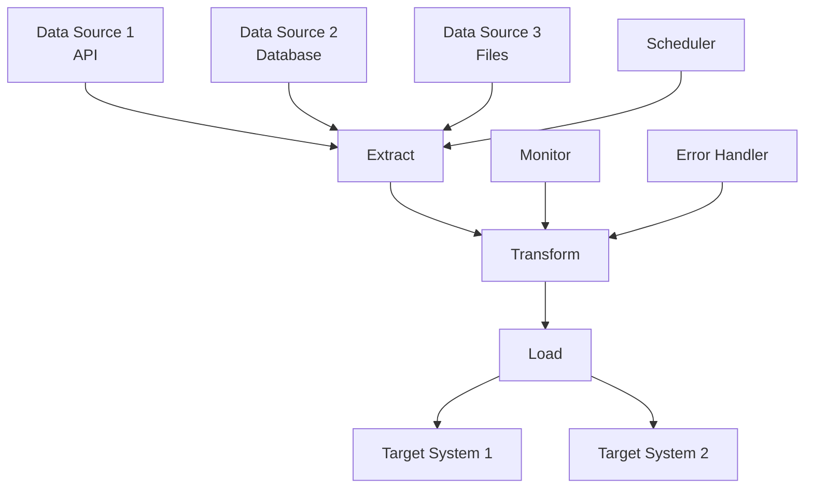

# Use Case 4: Data Pipeline Orchestrierung

## Übersicht

Orchestrierung von Data Pipelines zwischen verschiedenen Systemen mit ETL-Prozessen, Scheduling und Error Recovery.

## Szenario

**Problem:**
- Daten aus verschiedenen Quellen (APIs, Datenbanken, Files)
- Transformation zwischen Systemen erforderlich
- ETL-Prozesse
- Scheduling und Monitoring

**Lösung:**
- Automatische Data Pipeline Orchestrierung
- ETL-Prozesse
- Scheduling
- Error Recovery

## Anforderungen

### Funktionale Anforderungen

1. **Data Transformation**
   - Daten-Transformation zwischen Systemen
   - ETL-Prozesse
   - Data Validation

2. **Scheduling**
   - Cron-basierte Scheduling
   - Event-basierte Scheduling
   - Dependency-basierte Scheduling

3. **Monitoring**
   - Pipeline-Monitoring
   - Performance-Metriken
   - Error-Tracking

4. **Error Recovery**
   - Automatische Retries
   - Error-Handling
   - Data Recovery

### Nicht-funktionale Anforderungen

- **Performance**: Verarbeitung von Millionen von Records
- **Zuverlässigkeit**: 99.9% Success Rate
- **Skalierbarkeit**: Horizontal scaling
- **Data Quality**: Data Validation und Quality Checks

## Architektur



## Implementierung

### Option 1: Airflow

**Vorteile:**
- Data Pipeline fokussiert
- Mature Platform
- Große Community

**Beispiel-DAG:**
```python
from airflow import DAG
from airflow.operators.python import PythonOperator
from airflow.providers.postgres.operators.postgres import PostgresOperator
from datetime import datetime, timedelta

def extract_data(**context):
    """Extract data from source"""
    import requests
    response = requests.get('https://api.example.com/data')
    return response.json()

def transform_data(**context):
    """Transform data"""
    ti = context['ti']
    data = ti.xcom_pull(task_ids='extract_data')
    # Transformation logic
    transformed = [process_record(record) for record in data]
    return transformed

def load_data(**context):
    """Load data to target"""
    ti = context['ti']
    data = ti.xcom_pull(task_ids='transform_data')
    # Load logic
    load_to_database(data)

default_args = {
    'owner': 'airflow',
    'depends_on_past': False,
    'start_date': datetime(2024, 1, 1),
    'retries': 3,
    'retry_delay': timedelta(minutes=5),
}

dag = DAG(
    'data_pipeline',
    default_args=default_args,
    description='ETL Pipeline',
    schedule_interval=timedelta(hours=1),
)

extract = PythonOperator(
    task_id='extract_data',
    python_callable=extract_data,
    dag=dag,
)

transform = PythonOperator(
    task_id='transform_data',
    python_callable=transform_data,
    dag=dag,
)

load = PythonOperator(
    task_id='load_data',
    python_callable=load_data,
    dag=dag,
)

extract >> transform >> load
```

### Option 2: Prefect

**Vorteile:**
- Modern
- Python-first
- Gute Developer Experience

**Beispiel-Flow:**
```python
from prefect import flow, task
from prefect.tasks import task_input_hash
from datetime import timedelta

@task(cache_key_fn=task_input_hash, cache_expiration=timedelta(hours=1))
def extract_data(source: str):
    """Extract data from source"""
    import requests
    response = requests.get(source)
    return response.json()

@task
def transform_data(data: list):
    """Transform data"""
    transformed = [process_record(record) for record in data]
    return transformed

@task
def load_data(data: list, target: str):
    """Load data to target"""
    load_to_database(data, target)

@flow(name="data_pipeline")
def data_pipeline_flow(source: str, target: str):
    """ETL Pipeline"""
    # Extract
    raw_data = extract_data(source)
    
    # Transform
    transformed_data = transform_data(raw_data)
    
    # Load
    load_data(transformed_data, target)
    
    return len(transformed_data)

# Schedule
from prefect.schedules import CronSchedule

schedule = CronSchedule(cron="0 * * * *")  # Every hour

@flow(name="scheduled_data_pipeline", schedule=schedule)
def scheduled_pipeline():
    return data_pipeline_flow("https://api.example.com/data", "postgresql://...")
```

### Option 3: Argo Workflows

**Vorteile:**
- Kubernetes-native
- Container-basiert
- Skalierbar

**Beispiel-Workflow:**
```yaml
apiVersion: argoproj.io/v1alpha1
kind: Workflow
metadata:
  generateName: data-pipeline-
spec:
  entrypoint: etl-pipeline
  templates:
  - name: etl-pipeline
    steps:
    - - name: extract
        template: extract-data
    - - name: transform
        template: transform-data
        arguments:
          artifacts:
          - name: raw-data
            from: "{{steps.extract.outputs.artifacts.data}}"
    - - name: load
        template: load-data
        arguments:
          artifacts:
          - name: transformed-data
            from: "{{steps.transform.outputs.artifacts.data}}"
  
  - name: extract-data
    container:
      image: python:3.9
      command: [python, -c]
      args:
      - |
        import requests
        import json
        response = requests.get('https://api.example.com/data')
        data = response.json()
        with open('/tmp/data.json', 'w') as f:
            json.dump(data, f)
    outputs:
      artifacts:
      - name: data
        path: /tmp/data.json
  
  - name: transform-data
    inputs:
      artifacts:
      - name: raw-data
        path: /tmp/raw-data.json
    container:
      image: python:3.9
      command: [python, -c]
      args:
      - |
        import json
        with open('/tmp/raw-data.json', 'r') as f:
            data = json.load(f)
        transformed = [process_record(r) for r in data]
        with open('/tmp/transformed-data.json', 'w') as f:
            json.dump(transformed, f)
    outputs:
      artifacts:
      - name: data
        path: /tmp/transformed-data.json
  
  - name: load-data
    inputs:
      artifacts:
      - name: transformed-data
        path: /tmp/transformed-data.json
    container:
      image: postgres:14
      command: [sh, -c]
      args:
      - |
        psql $DATABASE_URL -c "COPY data FROM '/tmp/transformed-data.json'"
```

## Empfohlene Tools

### Für Data Pipelines: **Airflow**
- Data Pipeline fokussiert
- Mature Platform
- Große Community

### Für moderne Pipelines: **Prefect**
- Modern
- Python-first
- Gute Developer Experience

### Für Kubernetes: **Argo Workflows**
- Kubernetes-native
- Container-basiert
- Skalierbar

## Best Practices

1. **Data Quality**
   - Data Validation
   - Quality Checks
   - Data Profiling

2. **Error Handling**
   - Retry-Mechanismen
   - Error-Logging
   - Data Recovery

3. **Performance**
   - Parallel Processing
   - Caching
   - Resource Management

4. **Monitoring**
   - Pipeline-Monitoring
   - Performance-Metriken
   - Alerting

## Metriken & KPIs

- **Pipeline Success Rate**: > 99%
- **Data Processing Throughput**: > 1M Records/Stunde
- **Pipeline Execution Time**: < 30 Minuten
- **Data Quality Score**: > 95%

## Fazit

Data Pipeline Orchestrierung ist ideal für **Data-fokussierte Tools** wie **Airflow** oder **Prefect**. ETL-Prozesse, Scheduling und Error Recovery sind entscheidend.

