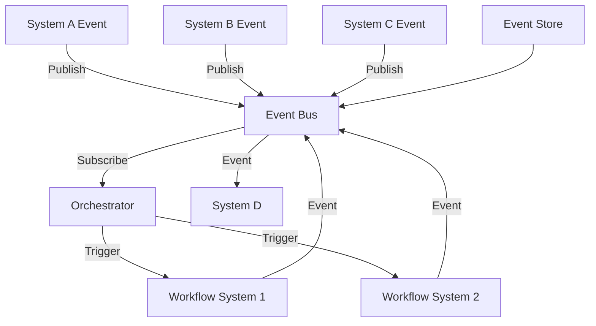

# Use Case 3: Event-basierte Workflow-Ketten

## Übersicht

Event-driven Automation mit Workflow-Ketten, die durch Events in verschiedenen Systemen ausgelöst werden und asynchrone Verarbeitung ermöglichen.

## Szenario

**Problem:**
- Events in verschiedenen Systemen (GitHub, GitLab, Slack, etc.)
- Workflows müssen auf Events reagieren
- Asynchrone Verarbeitung erforderlich
- Event Sourcing für Nachvollziehbarkeit

**Lösung:**
- Event-basierte Workflow-Ketten
- Event Bus Integration
- Asynchrone Verarbeitung
- Event Sourcing

## Anforderungen

### Funktionale Anforderungen

1. **Event Bus Integration**
   - Integration mit verschiedenen Event-Bussen
   - Event-Subscription
   - Event-Publishing

2. **Asynchrone Verarbeitung**
   - Asynchrone Event-Verarbeitung
   - Message Queues
   - Event-Ordering

3. **Event Sourcing**
   - Event-History
   - Event-Replay
   - Event-Audit

4. **Message Queues**
   - RabbitMQ, Kafka, Redis
   - Queue-Management
   - Message-Routing

### Nicht-funktionale Anforderungen

- **Latenz**: < 1 Sekunde für Event-Verarbeitung
- **Zuverlässigkeit**: 99.9% Event-Delivery
- **Skalierbarkeit**: Unterstützung für 1000+ Events/Sekunde
- **Durability**: Event-Persistence

## Architektur



## Implementierung

### Option 1: n8n

**Vorteile:**
- Event-basierte Workflows
- Webhook-Support
- Visueller Editor

**Workflow:**
1. Event von Event Bus empfangen
2. Event verarbeiten
3. Workflow in System B triggern
4. Event an System C weiterleiten

**Beispiel-Workflow:**
```json
{
  "nodes": [
    {
      "name": "RabbitMQ Trigger",
      "type": "n8n-nodes-base.rabbitmq",
      "parameters": {
        "queue": "events",
        "options": {}
      }
    },
    {
      "name": "Process Event",
      "type": "n8n-nodes-base.function",
      "parameters": {
        "functionCode": "const event = items[0].json;\nreturn [{json: {processed: true, event}}];"
      }
    },
    {
      "name": "Trigger Workflow",
      "type": "n8n-nodes-base.httpRequest",
      "parameters": {
        "url": "https://workflow-system/api/trigger",
        "method": "POST",
        "body": "={{ $json.event }}"
      }
    },
    {
      "name": "Publish Event",
      "type": "n8n-nodes-base.rabbitmq",
      "parameters": {
        "operation": "publish",
        "queue": "processed-events",
        "content": "={{ $json }}"
      }
    }
  ]
}
```

### Option 2: Temporal

**Vorteile:**
- Event Sourcing
- Durable Execution
- Multi-Language Support

**Beispiel-Workflow:**
```python
from temporalio import workflow, activity
from temporalio.client import Client

@activity
async def process_event(event: dict) -> dict:
    """Process event"""
    # Event processing logic
    return {"processed": True, "event": event}

@activity
async def trigger_workflow(workflow_id: str, event: dict) -> dict:
    """Trigger workflow in external system"""
    import requests
    response = requests.post(
        f'https://workflow-system/api/trigger/{workflow_id}',
        json=event
    )
    return response.json()

@workflow.defn
class EventDrivenWorkflow:
    @workflow.run
    async def run(self, event: dict) -> dict:
        # Process event
        processed = await workflow.execute_activity(
            process_event,
            event,
            start_to_close_timeout=60,
        )
        
        # Trigger workflow
        result = await workflow.execute_activity(
            trigger_workflow,
            "workflow-123",
            processed,
            start_to_close_timeout=60,
        )
        
        return result
```

### Option 3: Prefect

**Vorteile:**
- Event-driven Flows
- Webhook-Triggers
- Python-first

**Beispiel-Flow:**
```python
from prefect import flow, task
from prefect.events import Event
from prefect.events.schemas import EventTrigger

@task
def process_event(event: dict) -> dict:
    """Process event"""
    # Event processing logic
    return {"processed": True, "event": event}

@task
def trigger_workflow(workflow_id: str, event: dict) -> dict:
    """Trigger workflow in external system"""
    import requests
    response = requests.post(
        f'https://workflow-system/api/trigger/{workflow_id}',
        json=event
    )
    return response.json()

@flow
def event_driven_flow(event: dict):
    """Event-driven workflow"""
    processed = process_event(event)
    result = trigger_workflow("workflow-123", processed)
    return result

# Event trigger
@flow
def on_event(event: Event):
    """Triggered by event"""
    return event_driven_flow(event.payload)
```

## Event Bus Integration

### RabbitMQ

```python
import pika

connection = pika.BlockingConnection(pika.ConnectionParameters('localhost'))
channel = connection.channel()

channel.queue_declare(queue='events')

def callback(ch, method, properties, body):
    event = json.loads(body)
    # Process event
    process_event(event)

channel.basic_consume(queue='events', on_message_callback=callback, auto_ack=True)
channel.start_consuming()
```

### Kafka

```python
from kafka import KafkaConsumer

consumer = KafkaConsumer('events', bootstrap_servers=['localhost:9092'])

for message in consumer:
    event = json.loads(message.value)
    # Process event
    process_event(event)
```

### Redis Pub/Sub

```python
import redis

r = redis.Redis(host='localhost', port=6379, db=0)
pubsub = r.pubsub()
pubsub.subscribe('events')

for message in pubsub.listen():
    if message['type'] == 'message':
        event = json.loads(message['data'])
        # Process event
        process_event(event)
```

## Empfohlene Tools

### Für einfache Event-Workflows: **n8n**
- Event-basierte Workflows
- Webhook-Support
- Visueller Editor

### Für Event Sourcing: **Temporal**
- Event Sourcing
- Durable Execution
- Multi-Language Support

### Für Python-Teams: **Prefect**
- Event-driven Flows
- Webhook-Triggers
- Python-first

## Best Practices

1. **Event Design**
   - Strukturierte Event-Payloads
   - Event-Versioning
   - Event-Schema

2. **Event Processing**
   - Idempotente Event-Verarbeitung
   - Event-Ordering
   - Error Handling

3. **Event Sourcing**
   - Event-History
   - Event-Replay
   - Event-Audit

4. **Message Queues**
   - Queue-Management
   - Message-Routing
   - Dead Letter Queues

## Metriken & KPIs

- **Event Processing Latency**: < 1 Sekunde
- **Event Delivery Rate**: > 99.9%
- **Event Processing Throughput**: > 1000 Events/Sekunde
- **Event Replay Success Rate**: > 99%

## Fazit

Event-basierte Workflow-Ketten sind ideal für **Event-driven Tools** wie **n8n**, **Temporal** oder **Prefect**. Event Sourcing und asynchrone Verarbeitung sind entscheidend.

