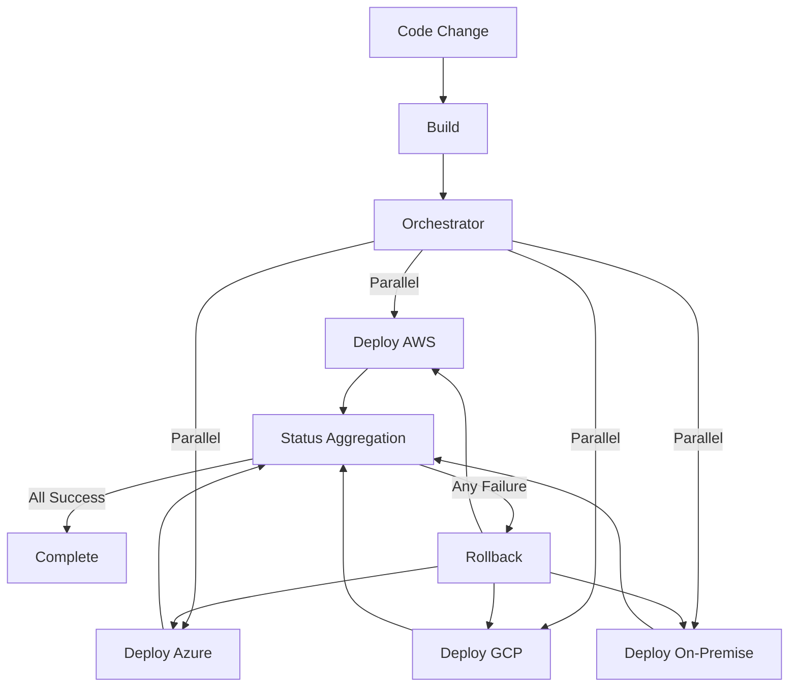

# Use Case 2: Multi-Platform Deployment

## Übersicht

Automatische Deployment-Orchestrierung zu mehreren Plattformen parallel mit Dependency Management, Status Aggregation und Rollback-Mechanismen.

## Szenario

**Problem:**
- Deployment zu mehreren Plattformen (AWS, Azure, GCP, On-Premise)
- Parallele Deployments erforderlich
- Dependency Management zwischen Deployments
- Status-Aggregation über Plattformen hinweg
- Rollback-Mechanismen erforderlich

**Lösung:**
- Automatische Orchestrierung von Multi-Platform Deployments
- Parallele Execution mit Dependency Management
- Status-Aggregation
- Automatische Rollback-Mechanismen

## Anforderungen

### Funktionale Anforderungen

1. **Parallel Execution**
   - Gleichzeitige Deployments zu mehreren Plattformen
   - Dependency Management
   - Resource Management

2. **Dependency Management**
   - Abhängigkeiten zwischen Deployments
   - Sequential vs. Parallel Execution
   - Conditional Dependencies

3. **Status Aggregation**
   - Aggregation von Status-Informationen
   - Gesamt-Status-Berechnung
   - Status-Benachrichtigungen

4. **Rollback-Mechanismen**
   - Automatisches Rollback bei Fehlern
   - Partial Rollback
   - Rollback-Strategien

### Nicht-funktionale Anforderungen

- **Performance**: Parallele Execution für schnelle Deployments
- **Zuverlässigkeit**: 99.9% Success Rate
- **Skalierbarkeit**: Unterstützung für 10+ Plattformen
- **Sicherheit**: Secure Credentials Management

## Architektur



## Implementierung

### Option 1: Argo Workflows

**Vorteile:**
- DAG-basierte Workflows
- Parallele Execution
- Kubernetes-native

**Beispiel-Workflow:**
```yaml
apiVersion: argoproj.io/v1alpha1
kind: Workflow
metadata:
  generateName: multi-platform-deploy-
spec:
  entrypoint: deploy
  templates:
  - name: deploy
    dag:
      tasks:
      - name: build
        template: build-image
      - name: deploy-aws
        template: deploy-aws
        dependencies: [build]
      - name: deploy-azure
        template: deploy-azure
        dependencies: [build]
      - name: deploy-gcp
        template: deploy-gcp
        dependencies: [build]
      - name: deploy-onprem
        template: deploy-onprem
        dependencies: [build]
      - name: aggregate-status
        template: aggregate-status
        dependencies: [deploy-aws, deploy-azure, deploy-gcp, deploy-onprem]
      - name: rollback
        template: rollback
        dependencies: [aggregate-status]
        when: "{{tasks.aggregate-status.outputs.result}} == failure"
  
  - name: build-image
    container:
      image: docker:latest
      command: [sh, -c]
      args:
      - |
        docker build -t myapp:$VERSION .
        docker push myapp:$VERSION
  
  - name: deploy-aws
    container:
      image: amazon/aws-cli:latest
      command: [sh, -c]
      args:
      - |
        aws ecs update-service --cluster mycluster --service myservice --force-new-deployment
  
  - name: deploy-azure
    container:
      image: mcr.microsoft.com/azure-cli:latest
      command: [sh, -c]
      args:
      - |
        az webapp deployment source sync --name myapp --resource-group myrg
  
  - name: deploy-gcp
    container:
      image: google/cloud-sdk:latest
      command: [sh, -c]
      args:
      - |
        gcloud run deploy myapp --image myapp:$VERSION
  
  - name: deploy-onprem
    container:
      image: curlimages/curl:latest
      command: [sh, -c]
      args:
      - |
        curl -X POST https://onprem-api/deploy \
          -H "Authorization: Bearer $TOKEN" \
          -d "image=myapp:$VERSION"
  
  - name: aggregate-status
    container:
      image: curlimages/curl:latest
      command: [sh, -c]
      args:
      - |
        # Aggregate status from all deployments
        aws_status=$(cat /tmp/aws-status)
        azure_status=$(cat /tmp/azure-status)
        gcp_status=$(cat /tmp/gcp-status)
        onprem_status=$(cat /tmp/onprem-status)
        
        if [ "$aws_status" == "success" ] && \
           [ "$azure_status" == "success" ] && \
           [ "$gcp_status" == "success" ] && \
           [ "$onprem_status" == "success" ]; then
          echo "success"
        else
          echo "failure"
        fi
  
  - name: rollback
    container:
      image: curlimages/curl:latest
      command: [sh, -c]
      args:
      - |
        # Rollback all deployments
        echo "Rolling back all deployments..."
```

### Option 2: Airflow

**Vorteile:**
- DAG-basierte Workflows
- Mature Platform
- Große Community

**Beispiel-DAG:**
```python
from airflow import DAG
from airflow.operators.bash import BashOperator
from airflow.operators.python import PythonOperator
from datetime import datetime, timedelta

def deploy_aws(**context):
    import boto3
    ecs = boto3.client('ecs')
    ecs.update_service(
        cluster='mycluster',
        service='myservice',
        forceNewDeployment=True
    )

def deploy_azure(**context):
    from azure.identity import DefaultAzureCredential
    from azure.mgmt.web import WebSiteManagementClient
    # Azure deployment logic

def aggregate_status(**context):
    # Aggregate status from all deployments
    ti = context['ti']
    aws_status = ti.xcom_pull(task_ids='deploy_aws')
    azure_status = ti.xcom_pull(task_ids='deploy_azure')
    # ... aggregate and return overall status

default_args = {
    'owner': 'airflow',
    'depends_on_past': False,
    'start_date': datetime(2024, 1, 1),
    'retries': 1,
    'retry_delay': timedelta(minutes=5),
}

dag = DAG(
    'multi_platform_deploy',
    default_args=default_args,
    description='Multi-platform deployment',
    schedule_interval=None,
)

build = BashOperator(
    task_id='build',
    bash_command='docker build -t myapp:$VERSION . && docker push myapp:$VERSION',
    dag=dag,
)

deploy_aws_task = PythonOperator(
    task_id='deploy_aws',
    python_callable=deploy_aws,
    dag=dag,
)

deploy_azure_task = PythonOperator(
    task_id='deploy_azure',
    python_callable=deploy_azure,
    dag=dag,
)

aggregate = PythonOperator(
    task_id='aggregate_status',
    python_callable=aggregate_status,
    dag=dag,
)

build >> [deploy_aws_task, deploy_azure_task] >> aggregate
```

### Option 3: Prefect

**Vorteile:**
- Python-first
- Modern
- Gute Developer Experience

**Beispiel-Flow:**
```python
from prefect import flow, task
import asyncio

@task
def deploy_aws(version: str):
    import boto3
    ecs = boto3.client('ecs')
    ecs.update_service(
        cluster='mycluster',
        service='myservice',
        forceNewDeployment=True
    )
    return "success"

@task
def deploy_azure(version: str):
    # Azure deployment logic
    return "success"

@task
def aggregate_status(results: list):
    if all(r == "success" for r in results):
        return "success"
    else:
        return "failure"

@flow
def multi_platform_deploy(version: str):
    # Parallel execution
    results = asyncio.gather(
        deploy_aws(version),
        deploy_azure(version),
        deploy_gcp(version),
        deploy_onprem(version)
    )
    
    overall_status = aggregate_status(results)
    
    if overall_status == "failure":
        # Rollback logic
        rollback_all()
    
    return overall_status
```

## Empfohlene Tools

### Für Kubernetes: **Argo Workflows**
- DAG-basierte Workflows
- Parallele Execution
- Kubernetes-native

### Für Data Pipelines: **Airflow**
- Mature Platform
- DAG-Support
- Große Community

### Für Python-Teams: **Prefect**
- Python-first
- Modern
- Gute Developer Experience

## Best Practices

1. **Parallel Execution**
   - Nutze DAG-basierte Workflows
   - Parallele Execution wo möglich
   - Dependency Management

2. **Status Aggregation**
   - Zentrales Status-Tracking
   - Aggregation-Logik
   - Status-Benachrichtigungen

3. **Rollback-Mechanismen**
   - Automatisches Rollback bei Fehlern
   - Partial Rollback möglich
   - Rollback-Strategien definieren

4. **Error Handling**
   - Retry-Mechanismen
   - Error-Logging
   - Error-Benachrichtigungen

## Metriken & KPIs

- **Deployment-Zeit**: < 10 Minuten für alle Plattformen
- **Success Rate**: > 99%
- **Rollback-Zeit**: < 5 Minuten
- **Parallel Execution Rate**: > 80%

## Fazit

Multi-Platform Deployment ist ideal für **DAG-basierte Workflow-Tools** wie **Argo Workflows** oder **Airflow**. Parallele Execution und Dependency Management sind entscheidend.

