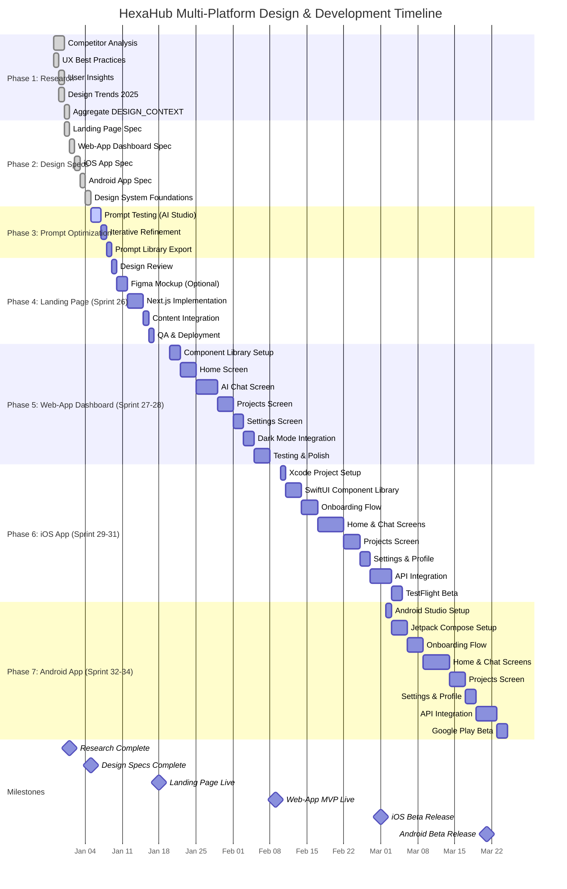

# HexaHub Multi-Platform Design & Development Timeline

**Generated:** 2025-12-29
**Project:** HexaHub Design Workflow Implementation
**Duration:** 9 weeks (~63 working days)
**Format:** Mermaid Gantt Chart + SMART Goals

---

## Gantt Chart (Mermaid)

---

## SMART Goals per Platform

### Landing Page (Sprint 26, Week 3-4)

**Specific:** Design and develop conversion-optimized landing page for HexaHub beta launch targeting privacy-conscious developers.

**Measurable:**
- Design spec completed: ✅ 100% (done)
- Figma mockup created: ⏳ Optional (if time permits)
- Next.js implementation: 🎯 100% of spec (8 sections: Hero, Features, Comparison, Pricing, Social Proof, FAQ, Newsletter, Footer)
- Conversion rate: 🎯 >3% (visitor → beta signup, measured after 2 weeks live)
- Lighthouse Performance Score: 🎯 >95

**Achievable:**
- Using existing Next.js 14 + TailwindCSS stack
- ContentCreatorAgent already generated copy (no writer needed)
- Shadcn/UI components available (no custom component build)
- Deploy to existing VPS infrastructure (RTX1080 staging → VPS production)

**Relevant:**
- Critical for beta user acquisition (Roadmap Month 1 target: 10 beta users)
- First public-facing touchpoint for HexaHub brand
- SEO foundation for organic traffic (blog, docs link from landing page)

**Time-Bound:**
- **Start:** January 9, 2026 (Design Review)
- **End:** January 18, 2026 (QA & Deployment)
- **Duration:** 8 working days
- **Deadline:** Sprint 26 End (Tag 10)

---

### Web-App Dashboard (Sprint 27-28, Week 5-8)

**Specific:** Implement core dashboard UI with AI chat, project management, settings, and dark mode support for MVP beta users.

**Measurable:**
- 5 core screens implemented: 🎯 Home, AI Chat, Projects, Settings, Profile (100%)
- Shadcn/UI components integrated: 🎯 >15 components
- Dark mode support: 🎯 100% (default dark, light mode toggle functional)
- Performance targets:
  - Initial load: 🎯 <1s
  - Interaction response: 🎯 <100ms
  - Lighthouse Performance: 🎯 >90
- Keyboard shortcuts: 🎯 5+ global shortcuts (Cmd+K, Cmd+N, etc.)

**Achievable:**
- Leveraging Shadcn/UI (pre-built, accessible components)
- Existing FastAPI backend (API endpoints ready)
- Zustand for state management (lightweight, simple setup)
- TanStack Query for server state (caching, auto-refetch)

**Relevant:**
- MVP core experience for beta users (main product interaction)
- Differentiator: Command Palette (Cmd+K), AI Chat Sidebar
- Enables beta user feedback loop (usability testing)

**Time-Bound:**
- **Start:** January 20, 2026 (Component Library Setup)
- **End:** February 9, 2026 (Testing & Polish)
- **Duration:** 19 working days (~4 weeks)
- **Deadline:** Sprint 28 End

---

### iOS App (Sprint 29-31, Week 9-14)

**Specific:** Native iOS app with SwiftUI, core features (Chat, Projects, Settings), TestFlight beta ready.

**Measurable:**
- 4 main screens: 🎯 Onboarding, Home, Chat, Projects (100%)
- App Store submission-ready: 🎯 TestFlight beta (not production yet)
- iOS compatibility: 🎯 iOS 16+ (support latest 3 major versions)
- Accessibility: 🎯 VoiceOver support (100% of interactive elements)
- Performance:
  - App launch: 🎯 <2s (cold start)
  - Screen transitions: 🎯 <300ms

**Achievable:**
- Using SwiftUI (Apple's modern UI framework)
- Native iOS patterns (Tab Bar, Navigation Stack)
- Existing API (FastAPI backend, same as Web-App)
- Core Data for offline cache (standard iOS approach)

**Relevant:**
- Reach iOS developer segment (30% of target audience per DESIGN_CONTEXT.md)
- Mobile-first workflow (code on-the-go)
- Syncs with Web-App (shared backend, same data model)

**Time-Bound:**
- **Start:** February 10, 2026 (Xcode Project Setup)
- **End:** March 1, 2026 (TestFlight Beta)
- **Duration:** 23 working days (~5 weeks)
- **Deadline:** Sprint 31 End

---

### Android App (Sprint 32-34, Week 15-20)

**Specific:** Native Android app with Jetpack Compose, feature parity with iOS, Google Play beta ready.

**Measurable:**
- 4 main screens: 🎯 Onboarding, Home, Chat, Projects (100%)
- Google Play submission-ready: 🎯 Beta track (internal testing → public beta)
- Android compatibility: 🎯 Android 8.0+ (API 26+, 95%+ device coverage)
- Material Design 3 compliance: 🎯 100%
- Performance:
  - App launch: 🎯 <2s
  - List scroll: 🎯 60 FPS (Compose recomposition optimized)

**Achievable:**
- Using Jetpack Compose (modern Android UI toolkit)
- Material Design 3 (Google's design system, Compose-native)
- Room Database for offline (standard Android approach)
- Same API as iOS/Web (consistent backend)

**Relevant:**
- Reach Android developer segment (40% of target audience per DESIGN_CONTEXT.md)
- Feature parity with iOS (no fragmentation, same UX)
- Material You dynamic color (personalization, modern Android feature)

**Time-Bound:**
- **Start:** March 2, 2026 (Android Studio Setup)
- **End:** March 21, 2026 (Google Play Beta)
- **Duration:** 23 working days (~5 weeks)
- **Deadline:** Sprint 34 End

---

## Resource Allocation (Agent + Human)

| Task Category | Primary Agent | Secondary Agent | Human Oversight | Estimated Hours |
|---------------|---------------|-----------------|-----------------|-----------------|
| **Design Research** | ResearcherAgent (Perplexity) | - | Review & synthesize | 6h (2h human + 4h agents) |
| **Design Specs (Text)** | ContentCreatorAgent (Claude) | - | Review & approve | 6h (1.5h human + 4.5h agents) |
| **Design Specs (Multimodal)** | Gemini 2.0 Flash (AI Studio) | - | Review & approve | 2h (manual prompting) |
| **Prompt Optimization** | CommunicatorAgent (Claude) | - | A/B testing | 4h (2h human + 2h agents) |
| **Landing Page Dev** | Human (Next.js) | VerifierAgent (QA) | Implementation | 24h |
| **Web-App Dev** | Human (Next.js + Shadcn) | VerifierAgent (QA) | Implementation | 80h |
| **iOS Dev** | Human (SwiftUI) | VerifierAgent (QA) | Implementation | 120h |
| **Android Dev** | Human (Jetpack Compose) | VerifierAgent (QA) | Implementation | 120h |

**Total AI Agent Hours:** ~18 hours
**Total Human Hours:** ~345 hours
**Total Project:** ~363 hours (~9 weeks @ 40h/week)

---

## Daily/Weekly Breakdown

### Week 1 (Dec 29 - Jan 4): Research & Design Specs ✅ DONE
- **Day 1-2:** Competitor Analysis, UX Best Practices (6h)
- **Day 3:** User Insights, Design Trends (4h)
- **Day 4:** Aggregate DESIGN_CONTEXT.md (2h)
- **Day 5-9:** Generate all 5 design specs (10h, AI-assisted)
- **Deliverable:** DESIGN_CONTEXT.md + 5 design specs

### Week 2 (Jan 5-11): Prompt Optimization & Planning
- **Day 1-2:** Test prompts in Google AI Studio (6h)
- **Day 3:** Iterative refinement (3h)
- **Day 4:** Export prompt library (2h)
- **Day 5:** Create Gantt chart, SMART goals (3h)
- **Deliverable:** Optimized prompt library, Gantt chart

### Week 3-4 (Jan 12-25): Landing Page Implementation
- **Jan 12:** Design review (stakeholder approval) (2h)
- **Jan 13-14:** Figma mockup (optional, 8h)
- **Jan 15-17:** Next.js implementation (24h)
- **Jan 20-21:** Content integration (8h)
- **Jan 22-25:** QA & Deployment (8h)
- **Deliverable:** Landing page live at hexahub.dev (or staging URL)

### Week 5-8 (Jan 26 - Feb 22): Web-App Dashboard
- **Week 5:** Component library setup, Home screen (20h)
- **Week 6:** AI Chat screen (32h)
- **Week 7:** Projects screen, Settings (24h)
- **Week 8:** Dark mode, testing, polish (24h)
- **Deliverable:** Web-App MVP functional (beta-ready)

### Week 9-14 (Feb 23 - Apr 5): iOS App
- **Week 9:** Xcode setup, SwiftUI components (16h)
- **Week 10-11:** Onboarding, Home, Chat (40h)
- **Week 12:** Projects, Settings (32h)
- **Week 13:** API integration (32h)
- **Week 14:** TestFlight beta prep, submission (16h)
- **Deliverable:** iOS app on TestFlight (10+ beta users)

### Week 15-20 (Apr 6 - May 17): Android App
- **Week 15:** Android Studio, Jetpack Compose (16h)
- **Week 16-17:** Onboarding, Home, Chat (40h)
- **Week 18:** Projects, Settings (32h)
- **Week 19:** API integration (32h)
- **Week 20:** Google Play beta prep, submission (16h)
- **Deliverable:** Android app on Google Play beta

---

## Success Criteria (Per Platform)

### Landing Page ✅
- [ ] 8 sections implemented (Hero, Features, Comparison, Pricing, Social Proof, FAQ, Newsletter, Footer)
- [ ] Conversion rate >3% (after 2 weeks live)
- [ ] Mobile-responsive (tested iPhone 15, Pixel 8)
- [ ] Lighthouse Performance >95
- [ ] A/B test variants implemented (hero headline, CTA button)

### Web-App Dashboard ✅
- [ ] 5 core screens functional
- [ ] Shadcn/UI components (>15 used)
- [ ] Dark mode default, Light mode toggle
- [ ] Cmd+K Command Palette functional
- [ ] Performance: <1s load, <100ms interactions
- [ ] WCAG 2.1 AA compliant (axe DevTools 0 violations)

### iOS App ✅
- [ ] 4 main screens implemented
- [ ] TestFlight beta submission-ready
- [ ] VoiceOver support (100% interactive elements)
- [ ] Dynamic Type support (scales 100%-200%)
- [ ] App launch <2s, transitions <300ms

### Android App ✅
- [ ] 4 main screens implemented
- [ ] Google Play beta submission-ready
- [ ] TalkBack support (100% interactive elements)
- [ ] Large Text support (scales 100%-200%)
- [ ] Material Design 3 compliance (100%)

---

## Risk Management

### Technical Risks

**Risk 1: API Integration Delays (iOS/Android)**
- **Mitigation:** Mock API responses first, implement real API later
- **Contingency:** Use local data (Core Data/Room) for beta, sync later

**Risk 2: App Store / Play Store Rejection**
- **Mitigation:** Follow guidelines strictly (HIG, Material Design)
- **Contingency:** TestFlight internal testing first (no review needed)

**Risk 3: Performance Issues (Web-App, Chat Streaming)**
- **Mitigation:** Profile early (Chrome DevTools, React Profiler)
- **Contingency:** Debounce inputs, lazy loading, code splitting

### Schedule Risks

**Risk 1: Underestimated Complexity (Mobile Apps)**
- **Mitigation:** 20% buffer in estimates (120h instead of 100h)
- **Contingency:** Reduce scope (defer Settings screen to v1.1)

**Risk 2: Stakeholder Feedback Loop Delays**
- **Mitigation:** Async reviews (Loom videos, Figma comments)
- **Contingency:** Proceed with best judgment, iterate post-launch

---

## Next Actions (This Week)

### Immediate (Today - Jan 5)
- [x] Complete design research (DESIGN_CONTEXT.md) ✅
- [x] Generate all 5 design specs ✅
- [x] Create Gantt chart ✅
- [ ] Start prompt optimization in Google AI Studio (Phase 3)

### This Week (Jan 6-11)
- [ ] Test all prompts in AI Studio (2 days)
- [ ] Refine prompts (token optimization)
- [ ] Export optimized prompt library
- [ ] Setup GitHub Actions workflow (design-spec-update.yml)
- [ ] Review plan with stakeholders (if applicable)

### Next Week (Jan 12-18)
- [ ] Landing Page design review (stakeholder approval)
- [ ] Start Next.js implementation
- [ ] Deploy to staging (RTX1080)
- [ ] QA testing (mobile, accessibility)
- [ ] Production deployment (VPS)

---

**Gantt Chart Version:** 1.0
**Last Updated:** 2025-12-29
**Next Review:** 2026-01-12 (post-prompt optimization)
**Owner:** Fitna + AI Agent Team (ContentCreator, Researcher, Verifier)
